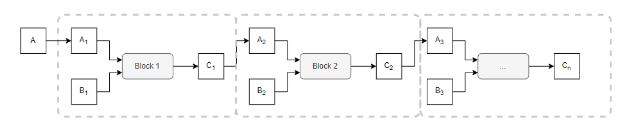
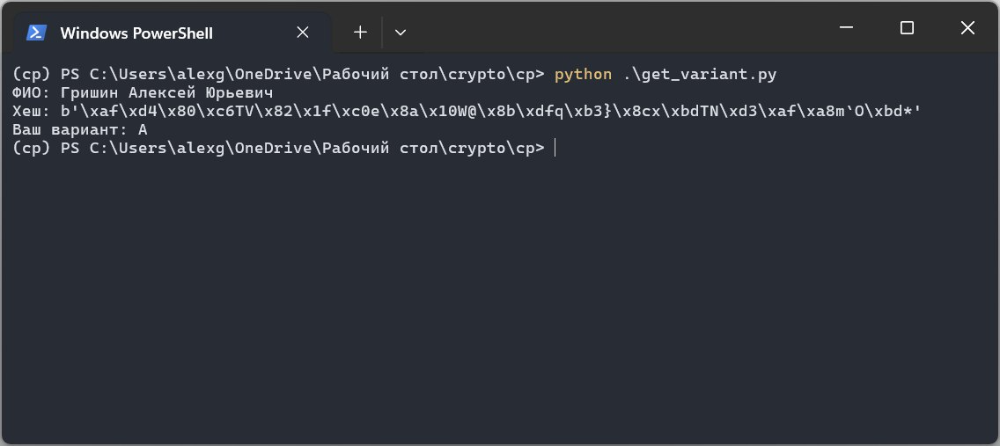
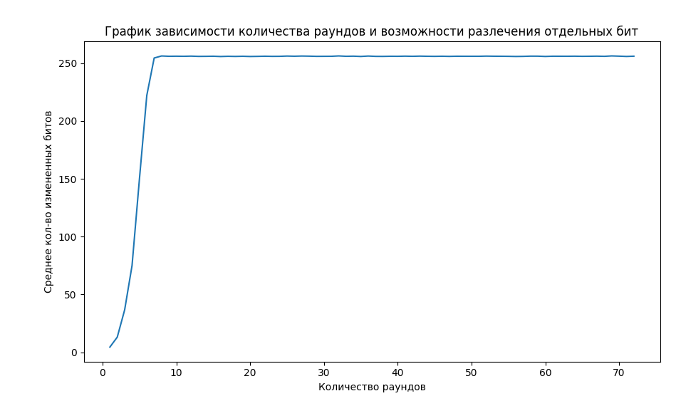
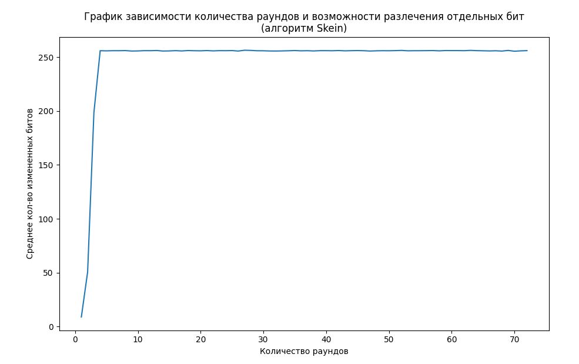

# Курсовой проект по курсу "Криптография"

## Тема

Темой курсовой работы является исследование и анализ алгоритмов функции хеширования в контексте криптографии. Основная цель работы - программная реализация выбранного алгоритма хеширования и его дальнейший анализ с разным числом раундов.

## Задание

1. Строку в которой записано своё ФИО подать на вход в хеш-функцию ГОСТ Р 34.11-2012 (Стрибог). Младшие 4 бита выхода интерпретировать как 16-тиричное число, которое в дальнейшем будет номером варианта.

2. Программно реализовать один из алгоритмов функции хеширования в соответствии с номером варианта. Алгоритм содержит в себе несколько раундов.

3. Модифицировать оригинальный алгоритм таким образом, чтобы количество раундов было настраиваемым параметром программы. в этом случае новый алгоритм не будет являться стандартом, но будет интересен для исследования.

4. Применить подходы дифференциального криптоанализа к полученным алгоритмам с разным числом раундов.

5. Построить график зависимости количества раундов и возможности различения отдельных бит при количестве раундов 1, 2, 3, 4, 5, ... .

6. Сделать выводы.

## Теория

### Итерационная модель

Одной из моделей, по которой строятся хеш-функции, является итерационная. Как видно из названия, она заключается в итерационном способе вычисления хеша. При такой модели алгоритм хеширования состоит из определенного количества одинаковых блоков, на вход которым подается пара из двух текстов $A_i$, $B_i$, а на выходе получается текст $C_i$, который передается на вход следующему блоку и так далее.



Касаемо размера блоков, стоит отметить, что каждый блок принимает на вход текст длины $k$, а на выходе выдает блок длины $n$. Блок $A$ играет роль константы и подается на вход первому блоку, остальные же блоки $A_i$, $i = 2, 3, \ldots, n$ представляют результат работы блоков на прошлой итерации и имеют размер $n$.

Блоки $B_i$, $i = 1, \ldots, n$ имеют размер $k - n$ и получаются в результате расширения входного сообщения $B$, имеющего длину $k$, до длины, кратной $k - n$, и последующего деления.

### Использование блочных симметричных алгоритмов

В качестве блоков можно использовать и блочные симметричные алгоритмы (как мы увидим далее в алгоритме Skein). При таком подходе текущий блок входного сообщения $B_i$ целесообразно подавать в качестве ключа алгоритму, а $A_i$ - в качестве входного сообщения. Таким образом, стойкость полученной модели зависит от выбора блочного алгоритма.

### Алгоритм Skein

Алгоритм Skein был разработан группой авторов под руководством Брюса Шнайера, который был основателем алгоритмов Blowfish, twofish. Этот алгоритм был финалистом в конкурсе NIST, но уступил алгоритму Keccak.

При разработке алгоритма авторы придерживались следующих идей:
- использовать как можно меньше памяти
- устойчивость к атакам
- простота реализации
- оптимизация под 64-разрядные процессоры

### Алгоритм Threefish

Как уже было упомянуто ранее, алгоритм Skein реализует итерационную модель хеш-функции с использованием блочного алгоритма. В качестве такого алгоритма был разработан Threefish. Его особенность в том, что вместо использования S-блоков для замены, он использует операции XOR, сложения по модулю и циклического сдвига.

Алгоритм Threefish предусматривает также задание конфигурационного tweak-значения, которое предназначено для настройки алгоритма путем изменения выходных данных.

В общем виде алгоритм threefish можно представить в виде функции $TF(K, T, A)$, где $K$ - ключ, представляющий слово длиной $n$ бит, $T$ - tweak-значение, представляющее слово длиной 128 бит и $A$ - открытый текст, представляющий слово длиной $n$ бит. Аргумент $n$ может принимать значения 256, 512 и 1024 бит. В результате своей работы алгоритм threefish возвращает слово длиной $n$ бит (так как он является симметричным).

Для увеличения безопасности шифра, на каждом раунде используются разные подключи, а также, после каждого 4-го раунда ключ добавляется к самому состоянию. Последнее также дает алгоритму защиту от методов перебора, обеспечивая более быстрое распространение изменений по всему блоку данных.

Работу алгоритма можно представить в виде следующих этапов

#### 1. Подготовка

В начале своей работы ключ $K$, tweak-значение $T$ и открытый текст $A$ разбиваются на блоки по 64 бит (собственно, поэтому и значения n должны быть кратны 64):

$$
k = (k_1 \ k_2 \ k_3 \ \ldots \ k_N),
a = (a_1 \ a_2 \ a_3 \ \ldots \ a_N),
t = (t_1 \ t_2)
$$

где $N = \left \lfloor \frac{n}{64} \right \rfloor$.

#### 2. Дополнение ключа и tweak-значения

Далее вектора, полученные путем разделения tweak-значения и ключа, дополняются одним элементом:

- $k_{N + 1} = C_{240} \oplus k_{1} \oplus \ldots \oplus k_{N}$
- $t_3 = t_1 \oplus t_2$

#### 3. Основной этап

После дополнения векторов происходит итерационное выполнение $R$ раундов. Число раундов $R$ зависит от размерности входных данных $n$ и равно 72 для 256 и 412 бит, и 80 - для 1024 бит.

Перед началом выполнения раундов формируется вектор $V$, представляющий состояние алгоритма на текущем раунде. Вектор $V$ имеет такую же размерность, что ключ и открытый текст, и его начальное значение равно $V = (a_1 \ a_3 \ \ldots \ a_N)$

Каждый раунд состоит из следующий шагов:

1. Формируется значение текущего подключа $s$. Отличие подключа от исходного ключа в том, что оно меняется каждые 4 раунда по следующей формуле

$$
s_i = \left\{ \begin{matrix}
    k_{1 + (s + i - 1) \mod (N + 1)} && i = \overline{1, N - 3} \\
    k_{1 + (s + i - 1) \mod (N + 1)} + t_{1 + (s - 1) \mod 3} && i = N - 2 \\
    k_{1 + (s + i - 1) \mod (N + 1)} + t_{1 + s \mod 3} && i = N - 1 \\
    k_{1 + (s + i - 1) \mod (N + 1)} + s && i = N \\
\end{matrix} \right.
$$

где $s = \left \lfloor \frac{d}{4} \right \rfloor$, а $d$ - номер текущего раунда

2. Далее формируется вектор $e = f(V, s)$ на основе вектора текущего состояния и подключа. Если номер текущего раунда $d$ не кратен 4-м, то $e = V$, в противном случае $e = V + s$. Иными словами, каждый четвертый раунд происходит добавление подключа к состоянию.

3. Далее, используя функцию MIX, формируется вектор $g$

$$
(g_{2i}, g_{2i + 1}) = MIX(e_{2i}, e_{2i + 1})
$$

4. И в конце, на основе матрицы $p$ формируется значение следующего состояния 

$$
V_i = g_{p(i)}, i = \overline{1, N}
$$

### UBI

Алгоритм Skein использует Threefish в разновидности режима Matyas-Meyer-Oseas, который называется UBI (Unique Block Iteration).

UBI устроен в виде цепочки блоков, которые мы можем представить в виде функции $UBI(A, B, T)$, где $A$ - начальное слово размера $n$, $B$ - входной текст произвольного размера и $T$ - tweak-значение, которое содержит информацию о количестве обработанных байт, флагах начала и конца цепочки и т. д.

Назначение каждого блока состоит в сжатии входных данных до определенного размера - $n$ байт. Результирующее значение каждый блок высчитывает итерационно следующим образом

$$
\begin{matrix}
    H_0 = A \\
    H_{i + 1} = TF(H_i, T_i, B_i) \\
\end{matrix}
$$

Здесь $B_i$ представляет $i$-й блок сообщения $B$, полученный после следующих действий.

Если длина сообщения $B$ не кратна 8-ми, то оно дополняется лидирующей единицей и идущими после нее нулями, а также флагу $F_{Final} = 1$ (в противном случае значение этого флага равно нулю).

Далее сообщение $B$ дополняется нулями до тех пор, пока его длина не будет кратна размеру блока для UBI - $n$. После чего $B$ разбивается на $k$ блоков: $B_1, B_2, \ldots,B_k$.

Tweak-значение для каждой итерации рассчитывается по следующей формуле

$$
T + \min⁡ \left\{m, (i + 1) \cdot n \right\}
+ \alpha_i \cdot 2 ^ 126
+ b_i \cdot (F_{First} \cdot 2 ^ 119 + 2 ^ 127)
$$

где $\alpha_i$, $b_i$ - специальные флаги, ответственные за поля First, Final и BitBand.

## Ход лабораторной работы

### Получение варианта

Для получения варианта я воспользовался библиотекой `pygost` на Python. Также, я реализовал небольшую программу, которая по входному ФИО определяет значение хеша и номер варианта по описанному в задании алгоритму.

```python
from pygost import gost34112012256

def get_last_bits(b: bytes) -> int:
    return b[-1] & 0b1111

name = input("ФИО: ")
hex_table = '0123456789ABCDEF'
encoded = gost34112012256.new(name.encode()).digest()
variant = get_last_bits(encoded)

print("Хеш:", encoded)
print("Ваш вариант:", hex_table[variant])
```
После запуска программы и ввода своего ФИО я получил следующий результат



Собственно, мои вариантом оказался вариант "А" - алгоритм Skein

При выполнении лабораторной работы я взял за основу для своей программной реализации библиотеку Python `gressify`, которая является в свою очередь версией библиотеки `pyskein`, переписанной на чистый Python.

Конечно, такая реализация значительно проигрывает по скорости работы библиотеке `pyskein`, однако тот факт, что исходный код написан на Python, позволило облегчить процесс интеграции настройки количества раундов в исходный код.

Далее, я упростил код, оставив только реализацию с 512-битным представлением состояния внутри. Дальнейший криптоанализ проводился конкретно с этой версией алгоритма Skein.

### Криптоанализ

Перед началом анализа алгоритма я учел, что Skein использует режим UBI, который также вносит свой вклад в лавинный эффект. Поэтому я решил сначала провести анализ алгоритма Threefish отдельно. В спецификации алгоритма Threefish было заявлено, что для крипто стойкости алгоритма достаточно 72 итераций для входных сообщений размера 256 и 512 бит, и 80 итераций для размера в 1024 бит. Поэтому я решил провести анализ алгоритм с варьированием количества раундов от 1 до 72-х. На каждой итерации я генерировал 100 случайных строк длины 512 бит. Далее, я генерировал 512 строк, представляющих исходную строку с одним измененным битом. Для каждой пары строк я высчитывал значение алгоритма Threefish с идентичным значением ключа. После обработки всех строк происходил расчёт среднего количества измененных битов во входном сообщении. Ниже представлен график изменения этого значения в зависимости от количества раундов



Данный график демонстрирует, как меняет хеш при минимальном изменении исходного сообщения. Учитывая, что размер выходного сообщения равен 512 битам, мы можем увидеть, что, начиная с 10 раундов, во выходном сообщении изменяется половина битов, что говорит нам о ярко выраженном лавинном эффекте.  Конечно, такой подход не дает полную информацию о криптостойкости алгоритма, однако мы можем утверждать, что криптоаналитику, при таком количестве раундов, уже будет сложно восстановить входное сообщение, имея лишь информацию только о выходном.

Проведем теперь анализ самого алгоритма Skein. Для анализа я использовал те же идеи, что и при анализе алгоритма Threefish:

- варьировалось количество раундов от 1 до 72-х с шагом 1
- для каждого количества раундов генерировалось по 100 сообщений с варьируемой длиной от 200 до 500 битов
- для каждой строки генерировались парные строки путем изменения одного бита
- для каждой пары сообщений высчитывалось значение хеша, после чего производился расчет количества отличающихся битов
- после обработки всех строк высчитывалось среднее количество отличающихся битов.



Как мы можем увидеть, минимальное количество раундов, которое потребовалось для изменения половины битов в выходном сообщении, уже немного меньше по сравнению с тем, которое потребовалось для алгоритма Threefish. Связано это с тем, что алгоритм Skein помимо использования Threefish, использует UBI, состоящую из 3-х блоков, что также оказывает влияние на лавинный эффект.

## Выводы

В ходе выполнения курсовой работы я осуществил программную реализацию криптографического алгоритма хеширования Skein. Алгоритм Skein оказался довольно интересным объектом для рассмотрения, так как его структура отличается от привычных структур других алгоритмов, но в то же время является лаконичной и простой.

Также, я провел криптоанализ алгоритма, выявив закономерность между количеством изменяющихся битов в выходном сообщении с количеством раундов. Я на практике убедился в важности большого количества раундов, так как это как минимум обеспечивает лавинный эффект.

## Список используемой литературы
- Обзорная статья про алгоритм Skein на Habr: https://habr.com/ru/articles/531140/
- Описание алгоритма Skein: https://www.pgpru.com/novosti/2008/heshfunkcijaskeiniblochnyjjshifrthreefish
- Официальный сайт алгоритма Skein: http://www.skein-hash.info/
- Статья Брюса Шнайера про алгоритм Skein: https://www.schneier.com/skein.html
