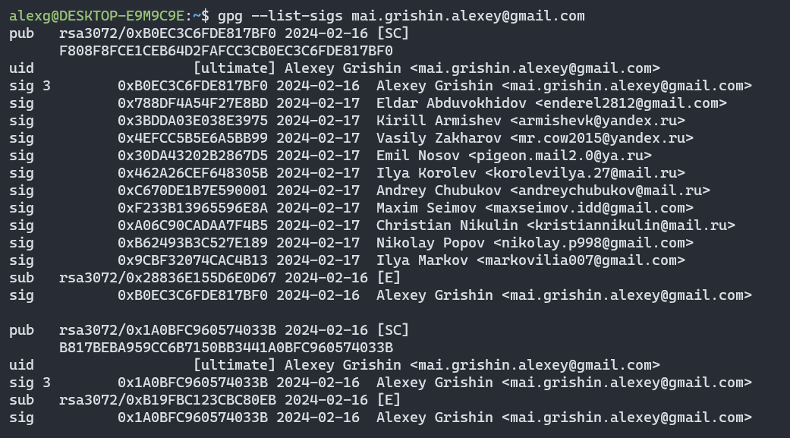

# Лабораторная работа №1 по курсу "Криптография"

## Тема

Темой данной лабораторной работы является знакомство с открытым стандартом для криптографических операций OpenPGP путем создания и использования пары ключей OpenPGP для обеспечения безопасности электронной почты. Основная цель работы — научиться создавать пару ключей, использовать их для шифрования и дешифрования сообщений, а также собирать подписи под своим сертификатом открытого ключа.

## Задание

1. Создать пару OpenPGP-ключей, указав в сертификате свою почту. Создать её возможно, например, с помощью почтового клиента thunderbird, или из командной строки терминала ОС семейства linux, или иным способом.

2. Установить связь с преподавателем, используя созданный ключ, следующим образом:

    1. Прислать собеседнику от своего имени по электронной почте сообщение, во вложении которого поместить свой сертификат открытого ключа.

    2. Дождаться письма, в котором собеседник Вам пришлет сертификат своего открытого ключа.

    3. Выслать сообщение, зашифрованное на открытом ключе собеседника.

    4. Дождаться ответного письма.

    5. Расшифровать ответное письмо своим закрытым ключом.

3. Собрать подписи под своим сертификатом открытого ключа.

    0. Получить сертификат открытого ключа одногруппника.

    1. Убедиться в том, что подписываемый Вами сертификат ключа принадлежит его владельцу - путём сравнения отпечатка ключа или ключа целиком, по доверенным каналам связи.

    2. Подписать сертификат открытого ключа одногруппника.

    3. Передать подписанный Вами сертификат полученный в п.3.2 его владельцу, т.е. одногруппнику.

    4. Повторив п.3.0.-3.3., собрать 10 подписей одногруппников под своим сертификатом.

    5. Прислать преподавателю свой сертификат открытого ключа, с 10-ю или более подписями одногруппников.

4. Подписать сертификат открытого ключа преподавателя и выслать ему

## Теория

### Стандарт OpenPGP

Стандарт OpenPGP нацелен на проблему защищенности данных при отправке. В качестве примера возьмем процесс отправки письма через электронную почту, так как стандарт изначально был нацелен на это. Когда мы отправляем письмо другому лицу есть риск возникновения несанкционированного доступа: письмо могут прочитать нежелательные для нас лица, они могут его изменить или отправить свое письмо от нашего лица. OpenPGP решает эти проблемы, предоставляя следующие возможности:

- **Шифрование данных:** стандарт предоставляет пользователям способ шифровки сообщений таким образом, что нежелательные лица не смогут его прочитать;

- **Цифровая подпись:** пользователи могут подписывать свои сообщения. Другой же пользователь может проверить письмо на подлинность и целостность;
- **Аутентификация:** пользователь при получении открытого ключа может проверить, действительно ли он принадлежит ему.

### Основная идея

Стандарт OpenPGP основывается на использовании асимметричного шифрования. При таком подходе каждый пользователь имеет пару из двух ключей: открытого и закрытого. Открытый ключ предназначен для шифрования сообщений. Он не играет критическую роль в защите информации и может легко передаваться по незащищенным каналам связи. Приватный же ключ используется для расшифровки сообщений. Он играет критическую роль в защите информации, поэтому должен находиться только у владельца пары ключей.
Процесс обмена информацией между двумя лицами, имеющими по паре ключей, следующий:

- оба участника обмениваются своими публичными ключами;
- один из участников шифрует свою информацию через публичный ключ собеседника и отправляет зашифрованное сообщение ему;
- другой участник, используя свой приватный ключ, расшифровывает данное сообщение.

Таким образом, отправить зашифрованное сообщение владельцу ключей может кто угодно, но расшифровать это сообщение может только владелец.

### Подписи

Проблема подлинности, как уже описывалось выше, решается через подписи. При отправке сообщения пользователю B пользователь A может подписать его, используя свой приватный ключ. При подписи зашифрованного сообщения файл расширяется путем добавления хеша, который относится приватному ключу пользователя.

С другой стороны, пользователь, получивший подписанное сообщение, может проверить его подлинность через публичный ключ отправителя.

Подпись также касается и самих сертификатов открытых ключей. Пользователи могут подписывать сертификаты открытого ключа других пользователей, подтверждая тем самым, что ключ действительно принадлежит указанному владельцу. При подписи исходные данные расширяются поставленной подписью.

При получении подписанного сертификата открытого ключа пользователь может проверить, кто подписал это ключ, если у него есть открытые ключи соответствующих пользователей. Тем самым создается в каком-то смысле сеть доверия, где у каждого участника есть открытые ключи других участников, в подлинности которых он может быть уверенным.

### Реализации OpenPGP

На практике стандарт OpenPGP реализуют такие утилиты как gpg (для unix систем) и gpg4win для ОС Windows. Для отправки и получения электронных писем существует отдельный почтоый клиент Thunderbird, который поддерживает стандарт OpenPGP, позволяя расшифровывать, зашифровать и просматривать расшифрованные письма прямо в программе.

## Ход лабораторной работы

При выполнении лабораторной работы я использовал утилиту gpg для создания ключей и произведения операций над ними (например, подпись).

1. **Подготовка рабочего пространства**

   Перед началом выполнения лабораторной работы я скачал утилиту gpg и заполнил ее конфигурационный файл следующим содержимым

   ```
   keyid-format 0xlong
   throw-keyids
   no-emit-version
   no-comments
   ```

2. **Создание ключа**

   Перед началом работы я создал у себя пару из закрытого и открытого ключей через утилиту gpg, введя команду gpg –gen-full-key. Далее в интерактивном режиме я ввел свое имя, почту, passphrase, промежуток времени, в течение которого ключ будет считаться действительным, и размер ключа.

3. **Отправка сертификата публичного ключа**

   Перед началом общения с собеседником мне необходимо было предоставить ему сертификат моего публичного ключа. Я его сгенерировал через команду `gpg --armor --output {filename}.asc --export {key-id}`. После сохранения сертификата с файл с расширением `.asc`, я отправил его собеседнику и, с другой стороны, получил от него сертификат.

4. **Расшифровка сообщения**

   После получения зашифрованного сообщения от собеседника мне необходимо было его расшифровать, чтобы получить его содержимое. Для этого я использовал команду `gpg --decrypt {filename}`, где `filename` – путь к файлу с зашифрованным сообщением.

5. **Шифрование сообщения**

   При отправке ответного сообщения собеседнику мне необходимо было зашифровать его с помощью открытого ключа, который собседеник мне отправил до этого.

   Для добавления открытого ключа собеседника в базу данных gpg я использовал команду `gpg --import {certificate}.asc`. Для шифрования сообщения я использовал команду `gpg --armor --encrypt --recipient {receiver-id} {message-file}`. Здесь `receiver-email` – электронный адрес получателя. 

6. **Подпись сертификата одногруппника**

   Одним из заданий, которое надо было выполнить в ходе лабораторной работы – подписать сертификат открытого ключа одногруппника. Для этого я использовал команду `gpg --sign-key {email}`. После этого я экспортировал уже подписанный мною сертификат открытого ключа и отправил его обратно одногруппнику.

   С другой стороны, я также собрал 10 подписей одногруппников. Для получения информации о подписях сертификата я использовал команду `gpg –list-sigs {email}`.

   

## Выводы

В ходе выполнения данной лабораторной работы я изучил основы зашифрованного обмена сообщениями на основе стандарта OpenPGP. Я научился пользоваться утилитой gpg, ознакомился с базовыми процессами, которые возникают при защищенному обмене сообщениями: создание ключей, передача публичных ключей, шифровка/расшифрока сообщения, подпись ключей и сообщений.

Хоть стандарт OpenPGP изначально был предназначен для передачи зашифрованной информации, данный стандарт имеет широкое применение и в других задачах. Например, в хранении паролей или в SSH.

Особое внимание стоит уделить подписи в стандарте OpenPGP, так как кажется, что эта идея может активно применяться в самых разных областях. Она может помочь решить проблему с идентификацией пользователя (например, для проходных карт сотрудников), или с проверкой данных на подлинность.

## Список используемой литературы

- Документация OpenPGP: https://www.openpgp.org/about/documentation/
- Обзорное видео про GPG: https://www.youtube.com/watch?v=I2mwqC6HGGE  
- GPG man page: https://linux.die.net/man/1/gpg
