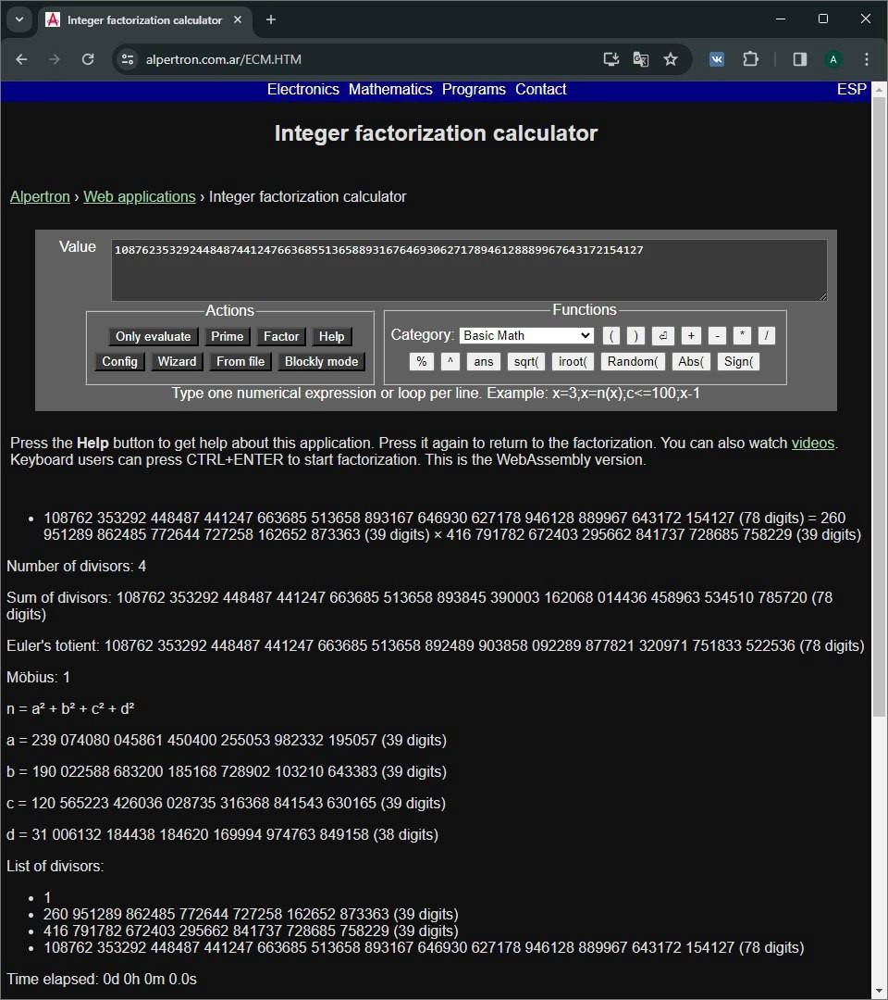

# Лабораторная работа №1 по курсу "Криптография"

## Тема

Темой данной лабораторной работы является факторизация чисел. Основная цель работы - ознакомиться с основными подходами и методами решения задачи факторизации больших чисел, применяемых в криптоанализе.

## Задание

Даны два положительных целых числа $n_1$, $n_2$. Необходимо разложить каждое из чисел $n_1$ и $n_2$ на нетривиальные сомножители.

- $n_1$ = 352358118079150493187099355141629527101749106167997255509619 020528333722352217

- $n_2$ = 169512848540208376377324702550860778129688385180093459660532 4477902989989672390098441314233687038522543796524362932674511659084990877094461405769068305253980165481952276151264282270169307424982451349364468884452626363366332792106697498300154504289109043538314722171490851577202002936469515837846884472685701320555954675270470981711883452876152967636160722991943031737727674462234803964546522349706678813412341712703190842025567979822278829254837642753739546649159

## Теория

Факторизация чисел тесно связана с асимметричным шифрованием. В частности, с алгоритмом RSA.

### Ассиметричное шифрование

Идея ассиметричного шифрования основывается на использовании пары ключей вместо одного, как это было в симметричном. Пусть $(P, Q)$ – пара ключей, где $P$ – открытый ключ, а $Q$ – закрытый. Открытый ключ используется в процессе обмена сообщениями только для шифрования. Его секретность никак не влияет на защищенность шифрования, поэтому $P$ может распространяться публично. Закрытый же ключ предназначен для расшифровки сообщения. Такой ключ уже имеет критическое влияние на защищенность процесса обмена сообщениями и должен храниться у владельца в секрете.

### Алгоритм RSA

Алгоритм RSA является непосредственной реализацией идеи ассиметричного шифрования и определяет алгоритм генерации пары открытого и закрытого ключей, а также шифрования и расшифрования сообщений. Основан такой метод на идее простых чисел и факторизации. Простой и закрытый ключ представляют собой пары из двух чисел: $P=(n, e)$, $Q=(n, q)$. Число $n$ определяется как результат произведения двух простых чисел $a, b$.

Далее, для определения чисел $e, d$ нам потребуется найти значение функции Эйлера: $\varphi(n) = (p - 1) \cdot (q - 1)$. Число $e$ определяется следующими условиями:

1. $e < \varphi(n)$;
2. Числа $e$ и $\varphi(n)$ - взаимно простые. То есть, $gcd⁡(e, \varphi(n)) = 1$.

Число $d$ определяется как обратное числу $e$ по модулю $\varphi(n)$.
Итого, как видим, все числа, которые представляют открытый и закрытый ключи, являются результатами некоторых операций над числами $a, b$. А следовательно, зная данную пару чисел, злоумышленник может получить всю необходимую ему информацию, в том числе и закрытый ключ.

## Ход лабораторной работы

При выполнении лабораторной работы я начал с анализа условия задачи. Несмотря на то, что условие задачи "найти нетривиальные делители числа" довольно общее, можно наложить на искомые делители числа некоторые ограничения:

1. Искомые делители являются простыми числами, так как в противном случае делители можно было бы разложить на более простые множители, которые также будут являться делителями данного числа. Если бы это условие не выполнялось, то задача стала бы слишком простой и наивные алгоритмы факторизации были бы эффективны.

2. Так как искомые делители – простые числа, то мы можем сделать вывод о том, что у данного числа будет ровно 2 простых делителя, так как мы не можем разложить простые числа на нетривиальные множители и получить новую пару нетривиальный множителей для данного числа.

Итого, задача сводится к поиску двух простых чисел $a, b < n : a \ne b$ таких, что $a \cdot b = n$, что является задачей "взлома" алгоритма RSA.

### Факторизация первого числа

Для факторизации первого числа я сначала пробовал наивные алгоритмы поиска, которые перебирали все целые числа от $2$ до $\sqrt{n}$, но очевидно, такой способ никаких результатов не дал. Далее, я решил использовать более оптимизированные алгоритмы, такие как алгоритм Ферма. Однако, такие алгоритмы также оказались недостаточно мощными для на столько большой длины числа. Также, были идеи распараллеливания вычисления и использования интерпретатора PyPy вместо стандартного CPython, однако такой подход давал прирост всего в 4-6 раз, что недостаточно по сравнению с объемом вычислений, которые необходимо было воспроизвести.

Далее, я обратился к самым оптимизированным на данный момент алгоритмам и библиотекам Python, которые их реализуют. Однако, такой способ тоже оказался слишком долгим.

Последним шагом было использование онлайн имплементации алгоритма метода эллиптической кривой (ECM) на сайте https://www.alpertron.com.ar/ECM.HTM, так как здесь алгоритм реализован на WebAssembly, что в разы оптимальнее использования таких высокоуровневых языков, как Javascript или Python. Такая реализация уже смогла найти делители числа за 4 минуты.



### Факторизация второго числа

Длина второго числа оказалась непосильной для любого из перечисленных методов. На этом этапе стал актуальным поиск альтернативного подхода к решению задачи, так как решение "напрямую", как это было при факторизации первого числа, уже не смог справиться.

Начальной идеей было использование статистического анализа не в рамках только данного числа, а в рамках всех предоставленных чисел из других вариантов.

Я решил провести анализ таких чисел и узнать, нет ли между ними каких-либо закономерностей или связей. Среди множества возможных вариантов результативной оказалась идея о том, что некоторые числа могут иметь одно общее число, через которое оно было образовано. Иными словами, если $n_1$, $n_2$ - рассматриваемые нами числа, то
$\exists a : n_1 = a \cdot k_1, n_2=a \cdot k_2$.

И так, если у двух чисел есть такое число $a$, то оно является их наибольшим общим делителем, так как:

1. Никакие другие нетривиальные делители кроме смежного $\frac{n}{a}$ не существуют в силу вышеописанных рассуждений;

2. Если $a < \frac{n}{a}$, то мы просто в рассуждении множители местами и все выводы сохраняют свой смысл.

Оставался открытым вопрос об эффективном поиске наибольшего общего делителя для двух чисел. Однако, такая задача просто и эффективно решается алгоритмом Евклида в силу его итеративности и простоты в вычислениях. Итого, задачу можно решить через следующий алгоритм

```python
def find_first_delimeter(target_number: int, numbers: Iterable[int]) -> int:
    for number in numbers:
        if (d := gcd(number, target_number)) != 1:
            return d
    raise ValueError(f"Can't find delimeter for {target_number}")

def main():
    target_number = 123 # целевое число, которое было дано в соответствующем варианте задания
    numbers = [ 456, 789, ... ] # остальные числа из других вариантов

    # поиск делителей
    a = find_first_delimeter(target_number, numbers)
    b = target_number // a

    # вывод результата в консоль для пользователя
    print(f'n: {target_number}')
    print(f'a: {a}')
    print(f'b: {b}')

    # проверка полученного результата
    print('Check:')
    print(f'a * b = {a * b}')
    print('Result: {}'.format(["FAILED", "SUCCESS"][a * b == target_number]))
```

## Выводы

В ходе выполнения данной лабораторной работы я ознакомился с основными алгоритмами и методами решения задачи факторизации числа. Я рассмотрел использование такой задачи на практике и ознакомился с реальными примерами.

Также, я на практике убедился, что не всегда «прямое» решение сможет привести к какому-либо результату или привести за разумное время.

Задача факторизации числа с использованием простых делителей является хорошим примером одной из главный идей криптографических функций, которые часто ассоциируют с их кратким описанием «легко вычисляются в одну сторону и неразумно сложно в обратную».

Использование таких функций, подходов, методов оказывает огромное влияние на криптостойкость и эффективность шифров, так как с одной стороны мы можем быстро зашифровать или расшифровать данные, имея нужную нам информацию, но получить такую информацию для злоумышленников становится практически нерешаемой задачей.

## Список используемой литературы

- Видео про ассиметричное шифрование: https://youtu.be/qgofSZFTuVc?si=sBlzrXmsqN6nXnik 
- Статья с описанием алгоритма RSA: https://habr.com/ru/articles/745820/ 
- Статья с описанием алгоритма Ферма на Wikipedia: https://ru.wikipedia.org/wiki/%D0%9C%D0%B5%D1%82%D0%BE%D0%B4_%D1%84%D0%B0%D0%BA%D1%82%D0%BE%D1%80%D0%B8%D0%B7%D0%B0%D1%86%D0%B8%D0%B8_%D0%A4%D0%B5%D1%80%D0%BC%D0%B0
