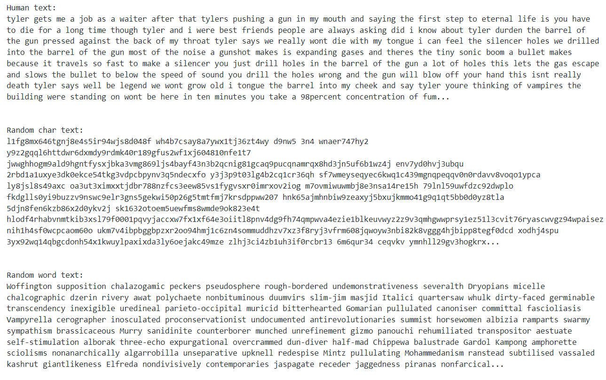

# Лабораторная работа №3 по курсу "Криптография"

## Тема

Темой данной лабораторной работы является статистический анализ открытого текста, его сравнение со случайным текстом, поиск особенностей осмысленного текста по сравнению со случайным.

## Задание

Необходимо сравнить:

1. два осмысленных текста на естественном языке;
2. осмысленный текст и текст из случайных букв;
3. осмысленный текст и текст из случайных слов;
4. два текста из случайных букв;
5. два текста из случайных слов.

Считать процент совпадения букв в сравниваемых текстах - получить дробное значение от 0 до 1 как результат деления количества совпадений на общее число букв.

Расписать подробно в отчёте алгоритм сравнения и приложить сравниваемые тексты в отчёте хотя бы для одного запуска по всем пяти случаям. Осознать какие значения получаются в этих пяти случаях. Привести соображения о том почему так происходит.

Длина сравниваемых текстов должна совпадать. Привести соображения о том какой длины текста должно быть достаточно для корректного сравнения.

## Теория

Критерием открытого текста в контексте криптографии называется способ определения, является ли данный текст "открытым". "Открытым" текстом называется какая-либо информация, которая была зашифрована. Например, "открытым" текстом может быть осмысленный текст (текст, написанный человеком и имеющий какой-либо смысл), изображение, звук, видео и т. д.

Стоит отметить, что "открытые" текста обычно удовлетворяют некоторым определенным правилам. Иными словами, они имеют схожую структуру, которая порой имеет очень сложно устройство (например, в контексте текстов, написанных людьми, это может быть грамматика языка).

Более формально, критерий открытого текста является задачей статистических гипотез, где нулевая гипотеза соответствует тому, что рассматриваемый текст A является открытым, а альтернативная - не является. Поэтому, в контексте критерия открытого текста часто применяют статистические методы.

Самым простым методом критерия открытого текста является поиск запретных N-грамм. Основывается данный метод на том, что в языках, на которых говорят и пишут люди, есть определенные сочетания букв, которые никак не могут встретиться. Среди таких могут быть биграммы "юю" и "чч". Далее, рассматриваемый текст A разбивается на соответствующие N-граммы. Для каждой N-граммы происходит проверка на то, не является ли она запретной. Если это так, то мы отклоняем нулевую гипотезу в пользу альтернативной. То есть, предполагаем, что рассматриваемый текст A является простым набором случайных букв, а не «открытым» текстом.

Также, некоторые методы открытого текста основаны на вероятностном распределении компонент текста (компонентом текста может быть буква, N-грамма, слово и т. д.). Как уже описывалось ранее, "открытые" текста примечательны тем, что имеют определенную структуру. Следовательно, в зависимости от контекста, вероятность появления элементов меняется. Например, можно заметить, что после буквы "о" с большей вероятностью будет идти согласная буква, чем гласная.

Еще одним примером особенностей построения "открытых" текстов могут быть частоты, с которыми встречаются определенные буквы алфавита. Известно, что в языках некоторые буквы встречаются чаще, а некоторые - довольно редки в использовании. Как раз на этой идее и основан критерий, который используется в задании. Ниже приведена гистограмма частот, с которыми встречаются буквы английского алфавита. 


## Ход лабораторной работы

### Поиск текстов

При выполнении лабораторной работы я начал с поиска осмысленных текстов. При поиске я отметил, что возможно стиль текста может также влиять на его статистические признаки. Поэтому, в качестве рассматриваемых текстов я взял литературные произведения, такие как "Собачье сердце" и "Мастер и Маргарита" Михаила Булгакова, "Замок" Франца Кафки, "Бойцовский клуб" Чака Паланика, а также субтитры некоторых подкастов на темы математики, программирования, искусства и т. д.

### Написание вспомогательных функций

Далее, я приступил к написанию кода. Первым делом я написал функцию для нормализации строки. Она необходима была для того, чтобы убрать из текста все "лишние" символы, такие как знаки препинания, кавычки и т. п.

```python
SKIP_CHARS = '.,:?`!;‘()/[]"“…”’\'>-'

def normalize_text(text: str) -> str:
    return ''.join(
        char for char in text
        if char not in SKIP_CHARS
    ).lower()
```

После этого я реализовал функцию, которая считывает текст и нормализует его непосредственно из открытого файла. Также, были реализованы функции для генерации строк из случайных букв и из случайных слов заданной длины.

```python
def read_text(file: TextIO) -> str:
    return ' '.join(
        chain.from_iterable(
            normalize_text(line).split()
            for line in file
        )
    )

def random_char_text(length: int) -> str: 
    letters = string.ascii_lowercase + ' ' + string.digits
    return ''.join(random.choice(letters) for _ in range(length))

def random_words_text(length: int, words: List[str]) -> str:
    text = ' '.join(random.choice(words) for _ in range(length))
    return text[:length]
```

Для сравнения текстов я реализовал функцию, задачей которой является подсчет точности совпадения букв в двух текстах. Работает такая функция путем итерационного попарного сравнения двух символов соответствующих строк. Результат каждого сравнения представляется в виде булева значения, который в Python также соответствует числам 1 и 0, чем я и воспользовался. Сложив такие числа, мы получим количество совпавших символов. Для того, чтобы узнать частоту, достаточно поделить найденное количество совпавших символов на длину текста.

```python
def accuracy(a: str, b: str) -> float:
    matches = sum(x == y for x, y in zip(a, b))
    return matches / len(a)
```

В нашем случае, частота совпадения символов в двух строках является значением некоторой случайной величины. Обычно, при статистическом анализе случайных величин находят такие характеристики, как среднее арифметическое и дисперсию. Поэтому я решил реализовать отдельную функцию для подсчета дисперсии на основе набора полученных значений.

```python
def variance(elements: List[float]) -> float:
    mean = sum(elements) / len(elements)
    return sum((x - mean) ** 2 for x in elements) / len(elements)
```

### Основная логика

После написания всех вспомогательных функций я приступил к написанию основной логики. Данный код считывает текст со всех файлов, пути которых указаны в списке. Далее происходит анализ двух типов текстов для каждого из описанных в задании случаев.

```python
def print_accuracy_results(accuracies: List[float], title: str) -> None:
    acc_mean = sum(accuracies) / len(accuracies)
    acc_variance = variance(accuracies)

    print(f'{title}:')
    print(f'accuracies: {", ".join(map(str, map(lambda x: round(x, 5), accuracies)))}')
    print(f'mean: {acc_mean:.5f}')
    print(f'variance: {acc_variance:.5f}')
    print()

# Считываем осмысленные текста из файлов
text_paths = [
    'texts/literature/heart-of-a-dog.txt',
    'texts/literature/fight-club.txt',
    'texts/literature/master-and-margarita.txt',
    'texts/literature/new-life.txt',
    'texts/literature/the-castle.txt',
    'texts/podcasts/1.txt',
    'texts/podcasts/2.txt',
    'texts/podcasts/3.txt',
    'texts/podcasts/4.txt',
    'texts/podcasts/5.txt',
]
human_texts = [
    read_text(open(path, 'r', encoding='utf-8'))
    for path in text_paths
]


# Считываем английские слова
with open('words.txt', 'r', encoding='utf-8') as words_file:
    random_words = [line.strip() for line in words_file]

# 2 осмысленных текста
N = min(map(len, human_texts))
accuracies = [
    accuracy(a[:N], b[:N])
    for a, b in combinations(human_texts, 2)
]
print_accuracy_results(accuracies, '2 human texts')

# осмысленный текст и текст из случайных букв
accuracies = [accuracy(text, random_char_text(len(text))) for text in human_texts]
print_accuracy_results(accuracies, 'human and random char texts')

# осмысленный текст и текст из случайных слов
accuracies = [
    accuracy(text, random_words_text(len(text), random_words))
    for text in human_texts
]
print_accuracy_results(accuracies, 'human and random word texts')

# два текста из случайных букв
N = 100_000
random_char_texts = [random_char_text(N) for _ in range(8)]
accuracies = [
    accuracy(a, b)
    for a, b in combinations(random_char_texts, 2)
]
print_accuracy_results(accuracies, '2 random char texts')

# два текста из случайных слов
random_word_texts = [random_words_text(N, random_words) for _ in range(8)]
accuracies = [
    accuracy(a, b)
    for a, b in combinations(random_word_texts, 2)
]
print_accuracy_results(accuracies, '2 random word texts')
```

### Анализ результатов

При запуске программы я получил следующие результаты.


Как видно, максимальный процент совпадения символов происходит при сравнении двух осмысленных текстов. Связано это с неравными вероятностями, с которыми буквы встречаются в текстах. Например, вероятность при подсчете процента совпадения рассмотреть пару 'e' и 'e' будет гораздо выше, чем 'm' и 'e'.

Обратная ситуация происходит в случаях, когда один из рассматриваемых текстов состоит из случайных букв. В этом случае процент совпадения принимает самые низкие значения. Связано это с тем, что при генерации такого случайного текста буквы имеют равномерное распределение. Поэтому, между буквами нет какого-то приоритета, который был свойственен осмысленным текстам. Также, стоит отметить интересное наблюдение: полученный процент совпадения символ в таких случаях примерно равен вероятности встретить такую же букву при равномерном распределении

$$
P = \frac{1}{27 + 10 + 1} = 0.02631578947368421
$$

Также, стоит отметить и случай, когда сравнение происходило с текстом, состоящих из случайных слов. В таких случаях процент совпадения уже значительно выше при сравнении с осмысленном текстом чем в случае сравнения осмысленного текста с текстом, состоящих из случайных букв. Связано это с тем, что слова, из которых состоит такой случайный текст, уже имеют такую же структуру, что и в осмысленном. Это сказывается и на частоте, с которой встречаются буквы. Однако, в таком тексте не была учтена связь между более крупными компонентами текста - словами. По этой причине процент совпадения оказывается ниже, чем при сравнении двух осмысленных текстов. К тому же, процент совпадения букв немного уменьшается в случае сравнения двух текстов, состоящих из случайных слов. Это также объясняется отсутствием зависимости между словами, ведь в таком случае слова будут выбираться равновероятно.

Также, в ходе лабораторной работы, проводился анализ с разной длиной текста. Однако, значения процента совпадения букв практически не изменялся. Это означает, что для определения статистических особенностей не требуется большая длина текста.

Ниже показаны примеры текстов, на основе которых происходил анализ. Так как объем текстов составлял примерно 100000 символов, то при отображении текстов, использующихся при анализе, было принято решение отобразить первые 1000 символов, так как такое количество является достаточным для того, чтобы продемонстрировать особенности структуру текстов каждого из трех типов: осмысленного, состоящего из случайных букв, состоящего из случайных слов.



## Выводы

В ходе выполнения данной лабораторной работы я ознакомился с одним из методов критерия текста. Я изучил, какие подходы и алгоритмы используются для сравнения текстов и об их назначении.

Алгоритм, реализованный в лабораторной работе, может быть применим, например, для определения того, является ли текст осмысленным, или же это набор случайных букв или символов. В таком случае рассматриваемый текст можно сравнить с некоторым корпусом текстов и на основе процента совпадения принять решение о том, что рассматриваемый текст открытый или нет. Как было выяснено в ходе лабораторной работе, можно заявлять, что рассматриваемый текст открытый, если процент совпадения превышает определенное значение (в нашем случае это было 7.859%).

Также, рассматриваемый в лабораторной работе метод может использоваться для оценки криптографического шифра. Известно, что одним из критериев шифра является то, на сколько хорошо он может скрывать статистические особенности входного «открытого» текста. Используя процент совпадения, мы можем оценить, на сколько полученный зашифрованный текст близок к «открытому» или тексту, состоящему из случайных символов. Как было выяснено в ходе лабораторной работы, чем ближе полученное значение к значению, полученному при сравнении осмысленного текста с текстом, состоящим из случайных символов, тем лучше шифр справляется с поставленной задачей.

## Список используемой литературы

- Сайт с информацией о частотах букв в английском алфавите: https://www3.nd.edu/~busiforc/handouts/cryptography/letterfrequencies.html 
- Статья "Статистические техники криптоанализа": https://habr.com/ru/articles/533974/ 
- "Криптографические методы и средства защиты информации" Бутакова Н. Г.
