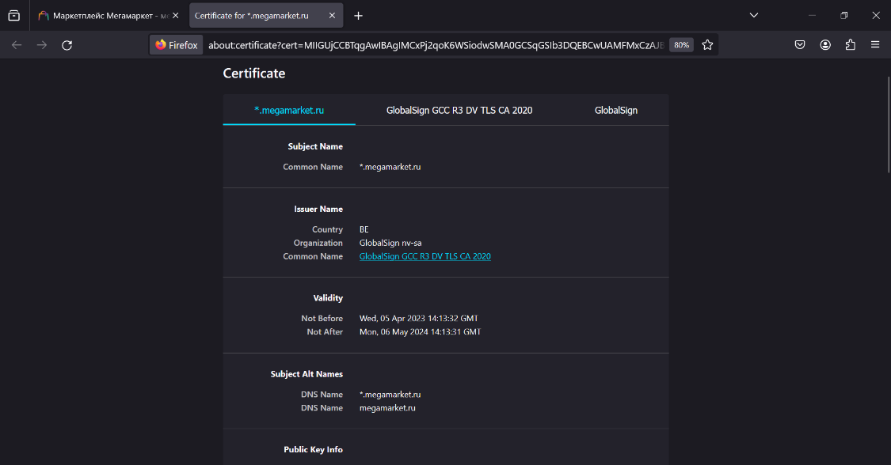

# Лабораторная работа №4 по курсу "Криптография"

## Тема

Темой данной лабораторной работы является аутентификация с асимметричными алгоритмами шифрования, а также анализ данных, отправляемых при использовании защищенного соединения по сети.

## Задание

Порядок выполнения лабораторной работы:

1. Выбрать не менее 2-ух web-серверов сети Интернет различной организационной и государственной принадлежности.

2. Запустить Wireshark и используя Firefox установить https соединение с выбранным сервером.

3. Провести анализ соединения.

4. Сохранить данные необходимы для последующего сравнительного анализа:
    - Имя сервера, его характеристики.
    - Версия TLS.
    - Выбранные алгоритмы шифрования.
    - Полученный сертификат:
        - Версия,
        - Валидность сертификата,
        - валидность ключа,
        - удостоверяющий центр.
    - Время установки соединения (от ClientHello до ClientHello)

5. Если список исследуемых серверов не исчерпан выбрать другой сервер и повторить соединение.

6. Если браузер поддерживал соединение TLS 1.2 принудительно изменить параметры TLS соединения в Firefox на TLS 1.0 (в браузере перейти по адресу about:config и изменить раздел SSL\TLS) и провести попытки соединения с выбранными серверами.

7. Провести сравнительный анализ полученной информации.

8.	В качестве отчета представить результаты сравнительного анализа, выводы в отношении безопасности и корректности настройки веб-серверов с учетом их организационной и государственной принадлежности.

## Теория

### Модель OSI

Модель OSI была придумана для описания архитектуры и принципов работы сетей передачи данных. Сама модель разделена иерархически на 7 слоев:

1. **Прикладной слой.** Предоставляет интерфейс для взаимодействия с программами.

2. **Слой представления.** Обрабатывает данные в такой формат, который будет удобно отправлять по сети.

3. **Сеансовый слой.** На этом слое происходит управление сеансами связи (создание и закрытие сеанса)

4. **Транспортный слой.** На этом слое происходит управления передачей данных. Среди протоколов, реализующий этот слой, самыми известными являются TCP и UDP.

5. **Сетевой слой.** На этом слое происходит маршрутизация сообщений. То есть, определяется маршрут, по которому пойдет сообщения от отправителя к получателю. Самый известный из протоколов, реализующих этот слой, является IPv4 (с недавнего времени набирает также и IPv6)

6. **Канальный слой.** Обеспечивает безошибочную передачу данных от одного узла к другому через физический слой.

7. **Физический слой.** Отвечает за физическое подключение между устройствами и передачу индивидуальных битов от одного узла к другому.

Как видим, каждый слой в модели OSI выполняет свою четко поставленную функцию. При отправке сообщения по сети, оно проходит все слои, начиная с самого верхнего и заканчивая самым нижним. При получении сообщения, оно проходит обратный путь.

### Протоколы HTTP и HTTPS

Для общения на уровне приложений одним из самых распространенных является протокол HTTP (Протокол передачи гипертекста). Такой протокол не устанавливает соединения. Иными словами, для отправки запроса на сервер необходимо открыть новое соединения. Однако, эта проблема была решена в HTTP/2.0 через механизм Streams.

Используя протокол HTTP, мы имеем в арсенале несколько методов отправки запросов. Самые популярные из них - GET, POST, PUT, DELETE. Они реализуют самые базовые сценарии работы - CRUD операции.

HTTPS (HyperText Transfer Protocol Secure) является расширением HTTP и использует шифрование для обеспечения безопасности данных. HTTPS использует SSL/TLS протоколы для шифрования коммуникаций.

### TLS/SSL протоколы

SSL (Secure Sockets Layer) - протокол, задачей которого является защита данных при их передаче по сети. В модели OSI он находится между транспортным и прикладным уровнями. Весь процесс работы SSL можно разделить на 2 этапа: установка соединения (handshake) и отправка сообщений.

Важно отметить, что на данный момент SSL уже не так часто используется. Вместо него используется протокол TLS (Transport Layer Security). Поэтому далее в большей степени речь пойдет о нем.

Для шифрования отправляемых сообщений в TLS используется симметричное шифрование. То есть, оба участника данного процесса (сервер и клиент) имеют один и тот же ключ для шифрования и расшифрования.

Перед началом отправки сообщения между участниками происходит процесс рукопожатия (handshake). Этот процесс можно разделить на следующие последовательные этапы:

1. Клиент инициализирует процесс рукопожатия, отправляя на сервер сообщение `Client Hello`. В таком сообщении содержится набор алгоритмов шифрования, поддерживаемых клиентом. Также, такое сообщение содержит случайное число, сгенерированное клиентом, которое называют `client_random`.

2. В ответ сервер отправляет сообщение `Server Hello`. Такое сообщение содержит `cipher suite`, содержащий выбранный сервером алгоритм шифрования, случайное число `server_random`, сгенерированное сервером и ID сессии.

3. После этого сервер отправляет второе сообщение - `Server Certificate`. Как видно из названия, такое сообщение содержит сертификат, подтверждающий подлинность сервера. Клиент же со своей стороны выполняет проверку сертификата.

4. После этого сервер отправляет сообщение `Server Hello Done`, после чего клиент генерирует случайное число `pre_master_key`. В совокупности, три сгенерированных числа `client_random`, `server_random`, `pre_master_key` используются для генерации секретного ключа, через который будут шифроваться сообщения. Сгенерированное число `pre_master_key` шифруется публичным ключом сервера и отправляется ему.

5. После этого клиент или сервер могут отправить сообщение `Change cipher specification`, которое обозначает, что участник с этого момента будет отправлять зашифрованные сообщения.

6. В конце процесса рукопожатия сервер отправляет сообщение `Handshake finished`, после чего идет переход к процессу обмена сообщениями.

### Сертификаты

Как было упомянуто выше, для проверки подлинности протокол TLS оперирует такой сущностью, как сертификат. Сертификат содержит внутри публичный ключ сервера. С самим сертификатом тесно связано понятие центра сертификации. Центр сертификации - третий участник процесса рукопожатия. Его задача состоит в генерации сертификатов и проверке их подлинности. Осуществляется это через подпись публичного ключа сервера центром сертификации, используя свой ключ.

При генерации центр сертификации создает сертификат, содержащий ID ЦС, ID сервера, публичный ключ сервера, отпечаток (контрольная сумма) сертификата. Далее происходит подпись сертификата центром, через использование приватного ключа центра.

Для проверки сертификата сервера клиент использует публичный ключ центра сертификации для расшифровки подписи. Далее, клиент высчитывает контрольную сумму. Если контрольные суммы совпадают, то мы можем заявлять, что сертификат не был подделан.

### Утилита WireShark

WireShark выполняет роль анализатора пакетов. Он используется для анализа проблем при работе по сети, для анализа протоколов, для изучения и разработки протоколов. Основной функционал WireShark - захват и визуализация пакетов, передаваемые через выбранную сеть.

## Ход лабораторной работы

### Выбор web-серверов

Для дальнейшего анализа в рамках лабораторной работы я выбрал следующие web-сервера:
- Госуслуги: https://gosuslugi.ru/
- Маркетплейс "Мегамаркет": https://megamarket.ru/ 

Для отправки запросов на web-сервера я использовал браузер Firefox.

### Установка соединения

Далее, я открыл приложение WireShark и запустил прослушивание по сети, к которой было подключено целевое устройство. После этого я установил http соединение с сервером gosuslugi.ru, открыв вкладку в браузере.

### Анализ полученных данных

Далее, я начал поиск пакетов, которые отправлялись в ходе установки соединения. Так как соединение было защищенным, то для поиска было достаточно указать в поле фильтрации аргумент `tls`. Известно, что при установке соединения с использованием протокола TLS первое сообщение отправляет клиент. Оно имеет вид специального пакета, называемого `Client Hello`. Для поиска таких сообщений, соответствующих началу процесса handshake, я добавил в строку фильтрации аргумент `tls.ech.client_hello_type`.

После нахождения пакетов,соответствующих рассматриваемой сессии подключения, я перешел к извлечению информации о web-сервере. Для начала я нашел пакеты `Client Hello`, `Server Hello` и `Certificate`.

Имя сервера я получил из поля `subject`, которое находилось в пакете `Certificate`. Такое поле находилось на уровне `Transport Layer Security` в поле `signedCertificate`. Как видим, имя web-сервера соответствует `*.gosuslugi.ru`.

Для получения версии TLS я воспользовался пакетом `Client Hello`. Такой пакет содержит поле `version` внутри `Handshake Protocol : Client Hello` на уровне `Transport Layer Security`, содержащий используемую версию протокола TLS. Как видим, web-сервера для handshake использовал версию 1.2.

Для получения информации об алгоритмах шифрования, используемых во время handshake, я воспользовался пакетом `Server Hello`. Такой пакет содержит поле `Cipher Suite` внутри `Handshake Protocol : Server Hello`. В нем содержится информация о выбранных алгоритмах шифрования со стороны сервера. Как видим, значение поля равно 
`TLS_ECDHE_RSA_WITH_AES_128_GCM_SHA256 (0xc02f)`.

Однако, для получения более подробной информации об используемых алгоритмах шифрования я дополнительно воспользовался сервисом https://ciphersuite.info/cs/. Сервис представляет собой сборник популярных алгоритмов шифрования, используемых при tls handshake. Его назначение состоит в выводе подробной информации об используемых алгоритмах шифрования на основе предоставляемого клиентом имени.

Как видим, в ходе TLS Handshake использовались следующие алгоритмы:

1. Для обмена ключами - ECDHE (Elliptic Curve Diffie-Hellman Ephemeral). Такой алгоритм позволяет установить общий секретный ключ.

2. Для подтверждения личности сервера - RSA. Он используется, когда сервер подписывает свой открытый ключ с помощью закрытого.

3. Алгоритм AES_128_GCM используется для подтверждения того, что сообщение не было изменено после его шифрования.

4. Алгоритм хеширования SHA256 использовался для проверки целостности сообщения.

Для получения серийного номера сертификата я использовал пакет `Certificate`. Он содержит поле `serialNumber` внутри которого и содержится серийный номер сертификата, представленный в 16-ричном формате. Его отформатированная версия будет выглядеть следующим образом: `11:09:C1:42:E3:60:5E:9F:4A:32:9B:C7` (каждый байт разделен символом `:`). Для получения версии сертификата я воспользовался полем `version`, которое находится рядом с полем `serialNumber`.

Для получения информации о центрах сертификации я использовал поле `issuer`, которое содержит каждый сертификат из поля `Certificates`. Такое поле содержит подробную информацию о центре сертификации, его местоположении и принадлежности компании.

Как видим, участвовали следующие центры сертификации:

1. **Страна:** Бельгия (BE)  
   **Организация:** GlobalSign nv-sa  
   **Имя:** GlobalSign GCC R3 DV TLS CA 2020

2.	**Организационное подразделение:** GlobalSign Root CA - R3  
   **Организация (O):** GlobalSign  
   **Имя:** GlobalSign

Как видим, оба центра сертификации принадлежат одной компании - GlobalSign. И, видимо, второй центр принадлежит подразделению этой компании.

Для получения информации о времени установки TLS Handshake я, используя WireShark, взял временные метки, соответствующие отправке пакета `Client Hello` и получению пакета `Server Hello Done`, соответствующему завершению процесса Handshake. Итоговое время составило 0.4806 секунды.

Для второго web-сервера были проделаны аналогичные действия. Для получения информации о сертификате использовалась функциональность браузера. Firefox позволяет пользователю при защищенном соединении просматривать информацию о сертификате сервера. Необходимость такого подхода также связана с тем, что при подключении через WireShark, к сожалению, не было найдено пакета `Certificate`. Связано это с тем, что современные браузеры используют механизм восстановления сессии, который позволяет пропустить большую часть процесса handshake, включая обмен сертификатами, для более быстрого установления соединения с сервером.

Итого, о web-серверах была собрана следующая информация:

**Сервер 1:**
- Имя сервера: *.gosuslugi.ru
- Версия TLS: 1.2
- Алгоритмы шифрования: ECDHE, RSA, AES_128_GCM, SHA256
- Серийный номер сертификата: 11:09:C1:42:E3:60:5E:9F:4A:32:9B:C7
- Версия сертификата: 3
- Центры сертификации:
    - Страна: Бельгия (BE)
    - Организация: GlobalSign nv-sa
    - Имя: GlobalSign GCC R3 DV TLS CA 2020
    - Организационное подразделение: GlobalSign Root CA - R3
    - Организация (O): GlobalSign
    - Имя: GlobalSign
- Время установки соединения: 0.4806 сек

**Сервер 2:**
- Имя сервера: *.megamarket.ru
- Версия TLS: 1.2
- Алгоритмы шифрования: AES (256 bit), SHA (384 bit)
- Серийный номер сертификата: 0B:13:E3:DA:AA:0A:E9:64:A2:A1:DC:12
- Версия сертификата: 3
- Центры сертификации:
    - Страна: Бельгия (BE)
    - Организация: GlobalSign nv-sa
    - Имя: GlobalSign GCC R3 DV TLS CA 2020
    - Организационное подразделение: GlobalSign Root CA - R3
    - Организация (O): GlobalSign
    - Имя: GlobalSign
- Время установки соединения: 0.272612 сек

### Изменение испольуземой версии TLS

Как можно увидеть, при установке TLS Handshake использовалась версия TLS 1.2. Это можно подтвердить, посмотрев на содержимое пакета `Client Hello`. Внутри `Handshake Protocol : Client Hello` можно увидеть поле `version`, которое и соответствует используемой версии TLS.

По условию лабораторной работы в таком случае необходимо поменять используемую версию TLS в браузере. Так как я использовал браузер Firefox, то для выполнения этой задачи мне потребовалось перейти в `config:about` и в advanced настройках браузера найти все параметры, относящиеся к SSL/TLS. Для этого я ввел в строке поиска `tls`. После чего я изменил значения `security.tls.version.max` и `security.tls.version.min` на 1. Это значение соответствует версии TLS 1.0.

После обновления значений параметров в настройках браузера при подключении к web-серверу действительно используется TLS 1.0. Убедиться в этом можно, посмотрев на пакет `Client Hello`, который отправляет браузер. Как видим, поле `version` теперь указывает на версию TLS 1.0, что и ожидалось.

Однако, в результате таких изменений при подключении к web-серверам происходит следующая ошибка

Ошибка `SSL_ERROR_NO_CYPHER_OVERLAP` связана с тем, что браузер и сервер не могут договориться насчет используемых алгоритмов шифрования. Когда мы явно указали браузеру использовать версию 1.0, то среди алгоритмов, отправляемых им при начале TLS Handshake, не было таких, которые поддерживал бы сервер.

## Выводы

В ходе данной лабораторной работы я ознакомился с основными методами анализа данных, передаваемых по сети. Я изучил протокол TLS, который используется для безопасного общения по сети, изучил основной процесс его работы. Также, я осознал, для чего используются сертификаты при защищенном подключении к web-серверам через браузер, и какую роль при общении по сети они играют, узнал их структуру и как можно просмотреть основную информацию, которая содержится в них.

На основе последнего задания этой лабораторной работы я понял, почему важно по возможности использовать последнюю версию протоколов, и как выбор устаревшей версии может сказаться на работе с web-сервером.

При выполнении лабораторной работы я столкнулся с некоторыми нюансами работы браузеров. Один из таких - использование ранее созданных TLS сессий вместо создания новой при каждом подключении.

TLS протокол является одним из хороших примеров того, как криптография используется в современных реалиях и на сколько важную роль она занимает при общении по сети. Также, такой протокол является примером того, почему в некоторых ситуациях именно асимметричное шифрование обеспечивает наиболее безопасный способ осуществления того или иного процесса.

## Список используемой литературы

- Статья на ресурсе Habr про работу с WireShark: https://habr.com/ru/articles/735866/

- Статья с объяснением протоколов TLS/SSL: https://skillbox.ru/media/code/protokol-ssl-chto-eto-kak-rabotaet-i-zachem-nuzhen/

- Конспекты лекций ИТМО на тему "SSL/TLS": https://neerc.ifmo.ru/wiki/index.php?title=SSL/TLS
