# Курсовая работа по дисциплине "Численные методы"

## Лабораторная работа №1

### О программе

Для выполнения данной лабораторной работы были написаны программы на языке программирования C++ для каждого из заданий. Для поддержки матричных операций был реализован класс `TMatrix`, объекты которого поддерживали операции сложения, матричного умножения матриц, чтение из файлов и форматированный вывод матрицы.

### Запуск программ

Для запуска программ необходимо скомпилировать исходный код путем ввода команды `g++ lab-1/task_{n}/main.cpp`, где `n` - номер задания. После чего запустить скомпилированный файл.

### Алгоритм LU-разложения матрицы

$LU$ разложение матрицы является методом решения задачи разложения матрицы $A$ в виде произведения нижней и верхней треугольных матриц $A = LU$, где $L$ - нижняя треугольная матрица, $U$ - верхняя треугольная матрица.

Одним из вариантов построения $LU$ разложения может быть использование метода Гаусса. Для понимания работы алгоритма рассмотрим $k$-й шаг метода Гаусса, на котором осуществляется обнуление поддиагональных элементов $k$-го столбца матрицы $A ^ {(k-1)}$. Элементы результирующей матрицы можно описать следующий образом:

$$
a_{ij} ^ {(k)} =
a_{ij} ^ {(k - 1)} - \mu_i ^ {(k)} \cdot a_{kj} ^ {(k - 1)}, \
\text{где} \
\mu_i ^ {(k)} = \frac{a_{ik} ^ {(k - 1)}}{a_{kk} ^ (k - 1)}; \
i = \overline{k + 1, n}; \
j = \overline{k, n}
$$

Если выразить данный процесс в виде матричных операций, то увидим, что данная запись эквивалентна записи $A ^ {(k)} = M_k \cdot A ^ {(k - 1)}$, где матрица $M$ определяется следующим образом:

$$
m_{ij} ^ k =\left\lbrace
    \begin{matrix}
        1, && i = j \\
        0, && i \ne j, j \ne k \\
        - \mu_{k + 1} ^ {(k)}, && i \ne j, j = k \\
    \end{matrix}
\right.
$$

Рассмотрим теперь, как можно выразить прямой ход метода Гаусса при помощи выше описанных матричных операций:

$$
A = A ^ {(0)} = M_{1} ^ {-1} \cdot A ^ {(1)} =
M_1 ^ {-1} \cdot M_2 ^ {-1} \cdot A ^ {(2)} =
M_1 ^ {-1} \cdot M_2 ^ {-1} \cdot \ldots \cdot M_{n - 1} ^ {-1} \cdot A ^ {(n - 1)}
$$

В результате прямого хода метода Гаусса получим $A ^ {(n-1)} = U$, где $U$ - верхняя треугольная матрица. Соответствующая матрице $U$ матрица $L$ может быть выражена следующий образом $L = M_1 ^ {-1} \cdot M_2 ^ {-1} \cdot \ldots \cdot M_{n - 1} ^ {-1}$. Если вычислить это выражение, то получим следующий вид матрицы

$$
L = \left( \begin{matrix}
    1 && 0 && 0 && 0 && 0 && 0 \\
    \mu_2 ^ {(1)} && 1 && 0 && 0 && 0 && 0 \\
    \mu_3 ^ {(1)} && \mu_3 ^ {(2)} && 1 && 0 && 0 && 0 \\
    \vdots && \ddots && \mu_{k + 1} ^ {(k)} && 1 && 0 && 0 \\
    \ldots && \ldots && \ldots && \ldots && \ldots && \ldots \\
    \mu_n ^ {(1)} && \mu_n ^ {(2)} && \mu_n ^ {(k + 1)} && \ldots && \mu_n ^ {(n - 1)} && 1\\ 
\end{matrix} \right)
$$

Полученное $LU$-разложение может быть эффективно использовано в задачах решения системы линейных алгебраических уравнений вида $A \cdot x = b$, в поиске детерминанта матрицы $\det ⁡A$, поиске обратной матрицы $A ^ {-1}$.

Рассмотрим более подробно процесс решения линейных алгебраических уравнений с помощью $LU$-разложения.

1. Первым шагом является разложение матрицы коэффициентов $A$ на произведение матриц $A = L \cdot U$. В итоге, исходное уравнение можно представить в виде $L \cdot U \cdot x = b$, или в виде системы

$$
\left\lbrace \begin{matrix}
    L \cdot z = b \\
    U \cdot x = z \\
\end{matrix} \right.
$$

2. На втором шаге решается уравнение $L \cdot z = b$. Поскольку матрица системы - нижняя треугольная, решение можно записать в явном виде: 

$$
y_1 = b_1, \
y_i = b_i - \sum_{j = 1} ^ {i - 1} l_{ij} \cdot y_j, \
i = \overline{2, n}
$$

3. И, в заключении, решается система $U \cdot x = z$ с верхней треугольной матрицей. Здесь, как и на предыдущем этапе, решение представляется в явном виде:

$$
x_1 = \frac{y_n}{u_{nn}}, \
x_i = \frac{1}{u_{ii}} \cdot \left( y_i - \sum_{j = i + 1} ^ {n} u_{ij} \cdot y_j \right), \
i = \overline{n - 1, 1}
$$

Также, задачу поиска определителя матрицы $A$ можно легко свести к задаче $LU$-разложения. Разложив матрицу в виде произведения $A = L \cdot U$ ее определитель можно найти по формуле:

$$
\det A = \prod_{i = 1} ^ {n} l_{ii} \cdot u_{ii}
$$

Задачу поиска обратной матрицы также можно свести к задаче $LU$-разложения, если воспользоваться свойством $A \cdot A ^ {-1} = L \cdot U \cdot A ^ {-1} = E$. Это уравнение также можно решить методом $LU$ разложения. 

#### Входные данные

Ниже приведен пример входных данных для решения систему линейный алгебраических уравнений, соответствующий моему варианту

$$
\left\lbrace \begin{matrix}
    x_1 - 5 \cdot x_2 - 7 \cdot x_3 + x_4 = -75 \\
    x_1 - 3 \cdot x_2 - 9 \cdot x_3 - 4 \cdot x_4 = -41 \\
    -2 \cdot x_1 + 4 \cdot x_2 + 2 \cdot x_3 + x_4 = 18 \\
    -9 \cdot x_1 + 9 \cdot x_2 + 5 \cdot x_3 + 3 \cdot x_4 = 29 \\
\end{matrix} \right.
$$

#### Реализация LU-разложения

Ниже предоставлен исходный код, содержащий реализацию алгоритма $LU$-разложения. Также, стоит отметить, что данная реализация имеет оптимизацию в виде введения дополнительной матрицы перестановок $P$, что применимо конкретно к выполнения алгоритма на ЭВМ.

```cpp
std::pair<int, int> ForwardStep(Matrix::TMatrix& m, int k, std::vector<float>& coef) {
    int n = m.GetSize().first;

    // find element with maximum square to avoid small dividers
    int swapIndex = k;

    for (int i = k + 1; i < n; ++i) {
        float a = m.Get(swapIndex, k);
        float b = m.Get(i, k);

        if (a * a > b * b) {
            swapIndex = i;
        }
    }

    m.SwapRaws(k, swapIndex);

    // try to find a string with a non-zero element
    // and swap it with the current
    if (m.Get(k, k) == 0.0) {
        return {k, k};
    }

    // convert raws below so that the elements are zero
    for (int i = k + 1; i < n; ++i) {
        float c = m.Get(i, k) / m.Get(k, k);

        for (int j = k; j < n; ++j) {
            m.Set(i, j, m.Get(i, j) - c * m.Get(k, j)); 
        }

        coef.push_back(c);
    }
    return {k, swapIndex};
}

void LUDecompose(
    const Matrix::TMatrix& a,
    Matrix::TMatrix& l,
    Matrix::TMatrix& u,
    Matrix::TMatrix& p
) {
    int n = a.GetSize().first;
    std::vector<float> coef;

    p = Matrix::TMatrix::Eye(n);
    l = Matrix::TMatrix::Eye(n);
    u = a;

    coef.reserve(n); // reserve max possible number of bytes to avoid allocations

    for (int k = 0; k < n - 1; ++k) {
        std::pair<int, int> swap = ForwardStep(u, k, coef);

        for (int i = 0; i < coef.size(); ++i) {
            l.Set(i + k + 1, k, coef[i]);
        }

        p.SwapRaws(swap.first, swap.second);

        coef.clear();
    }
}
```

#### Реализация решения СЛАУ с помощью LU-разложения

Ниже представлен код, содеражщий реализацию алгоритма решения системы линейных алгебраических уравнений с помощью ранее описанного $LU$-разложения.

```cpp
void SolveWithL(const Matrix::TMatrix& l, const Matrix::TMatrix& b, Matrix::TMatrix& x) {
    int n = l.GetSize().first;

    for (int i = 0; i < n; ++i) {
        float c = b.Get(i, 0);
        for (int j = 0; j < i; ++j) {
            c -= x.Get(j, 0) * l.Get(i, j);
        }
        x.Set(i, 0, c);
    }
}

void SolveWithU(const Matrix::TMatrix& u, const Matrix::TMatrix& b, Matrix::TMatrix& x) {
    int n = u.GetSize().first;

    for (int i = n - 1; i >= 0; --i) {
        float c = b.Get(i, 0);

        for (int j = i + 1; j < n; ++j) {
            c -= x.Get(j, 0) * u.Get(i, j);
        }

        c /= u.Get(i, i);
        x.Set(i, 0, c);
    }
}

void SolveSystem(
    const Matrix::TMatrix& l,
    const Matrix::TMatrix& u,
    const Matrix::TMatrix& p,
    const Matrix::TMatrix& b,
    Matrix::TMatrix& x
) {
    Matrix::TMatrix z(b.GetSize().first, 1);
    SolveWithL(l, p * b, z);
    SolveWithU(u, z, x);
}
```

#### Результат

Ниже предоставлен пример работы программы с входными данными, соответствующими моему варианту

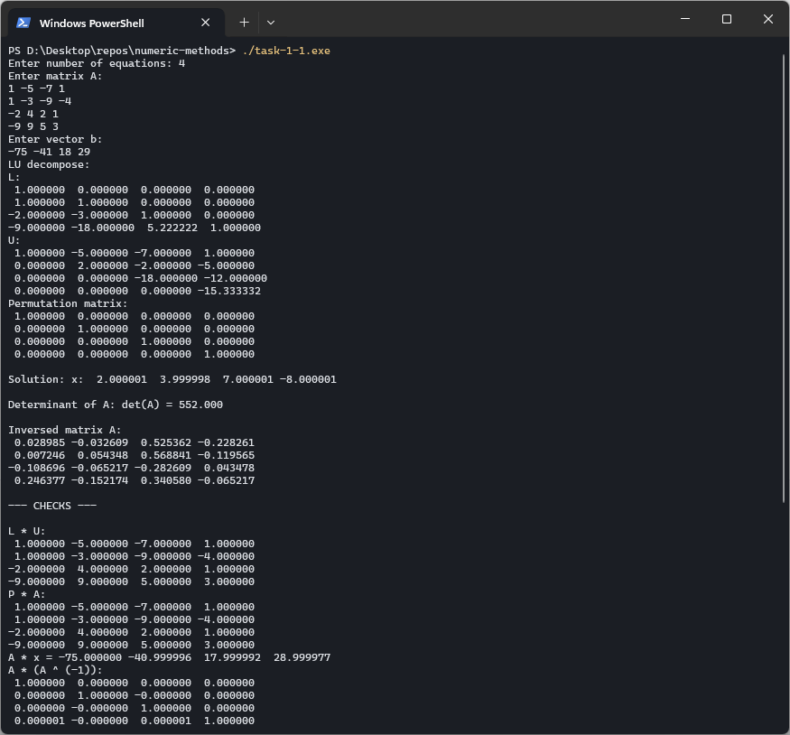

### Метод прогонки

Для случаев, когда в СЛАУ матрица коэффициентов имеет трехдиагональный вид:

$$
\left\lbrace \begin{matrix}
    b_1 \cdot x_1 + c_1 \cdot x_2 = d_1 \\
    a_2 \cdot x_1 + b_2 \cdot x_2 + c_2 \cdot x_3 = d_2 \\
    a_3 \cdot x_2 + b_3 \cdot x_3 + c_3 \cdot x_4 = d_3 \\
    \ldots \\
    a_{n - 1} \cdot x_{n - 2} + b_{n - 1} \cdot x_{n - 1} + c_{n - 1} \cdot x_n = d_{n - 1} \\
    a_n \cdot x_{n - 1} + b_n \cdot x_n = d_n \\
\end{matrix} \right.
$$

может быть применен более оптимизированный вид метода Гаусса под названием метод прогонки. При использовании метода прогонки, решение системы происходит итеративно следующим образом

$$
x_i = P_i \cdot x_{i + 1} + Q_i, \
i = \overline{1, n}
$$

где $P_i$, $Q_i$ - прогоночные коэффициенты, определяемые по формулам

$$
\begin{matrix}
P_i =\left\lbrace \begin{matrix}
    - \frac{c_1}{b_1}, && i = 1 \\
    \frac{-c_i}{b_i + a_i \cdot P_{i - 1}}, && \text{иначе} \\ 
\end{matrix} \right.

&&

Q_i =\left\lbrace \begin{matrix}
    \frac{d_1}{b_1}, && i = 1 \\
    \frac{d_i - a_i \cdot Q_{i - 1}}{b_i + a_i \cdot P_{i - 1}}, && \text{иначе} \\
\end{matrix} \right.
\end{matrix}
$$

После того как будут найдены все прогоночные коэффициенты, что соответствует этапу прямого хода метода прогонк, можно вычислить значения неизвестных путем обратной подстановки (обратный ход):

$$
\begin{matrix}
    x_n = P_n \cdot x_{n + 1} + Q_n = 0 \cdot x_{n + 1} + Q_n = Q_n \\
    x_{n - 1} = P_{n - 1} \cdot x_n + Q_{n - 1} \\
    x_{n - 2} = P_{n - 2} \cdot x_{n - 1} + Q_{n - 2} \\
    \ldots \\
    x_1 = P_1 \cdot x_2 + Q_1 \\
\end{matrix}
$$

Для того, чтобы удостовериться, что данные подходят для решения методом прогонки, можно воспользоваться достаточным условием корректности и устойчивости к погрешностям вычислений является условие преобладания диагональных коэффициентов:

$$
\left| b_i \right| \ge \left| a_i \right| + \left| c_i \right|
$$

#### Входные данные

Ниже приведен пример входных данных для решения систему линейный алгебраических уравнений, соответствующий моему варианту

$$
\left\lbrace \begin{matrix}
    15 \cdot x_1 + 8 \cdot x_2 = 92 \\
    2 \cdot x_1 - 15 \cdot x_2 + 4 \cdot x_3 = -84 \\
    4 \cdot x_2 + 11 \cdot x_3 + 5 \cdot x_4 = -77 \\
    -3 \cdot x_3 + 16 \cdot x_4 + (-7) \cdot x_5 = 15 \\
    3 \cdot x_4 + 8 \cdot x_5 = -11 \\
\end{matrix} \right.
$$

#### Реализация решения СЛАУ с помощью метода прогонки

Ниже предоставлен пример кода, содержащего реализацию метода прогонки и решения СЛАУ с трехдиагональной матрицей с помощью него

```cpp
void CalculateRunCoefficients(const Matrix::TMatrix& A, const Matrix::TMatrix& B, Matrix::TMatrix& result) {
    int n = A.GetSize().first;

    for (int i = 0; i < n; ++i) {
        float a = A.Get(i, 0), b = A.Get(i, 1), c = A.Get(i, 2);
        float d = B.Get(i, 0);

        if (i == 0) {
            if (B.Get(i, 0) == 0.0) {
                throw std::runtime_error("Can't find solution of system");
            }

            result.Set(i, 0, - c / b);
            result.Set(i, 1, d / b);
        }

        else {
            float PLast = result.Get(i - 1, 0), QLast = result.Get(i - 1, 1);
            float t = b + a * PLast;

            if (t == 0.0) {
                throw std::runtime_error("Can't find solution of system");
            }

            result.Set(i, 0, - c / t);
            result.Set(i, 1, (d - a * QLast) / t);
        }
    }
}

void SolveUsingRunCoefficients(const Matrix::TMatrix& runCoefs, Matrix::TMatrix& result) {
    int n = runCoefs.GetSize().first;

    result.Set(n - 1, 0, runCoefs.Get(n - 1, 1));
    for (int i = n - 2; i >= 0; --i) {
        result.Set(i, 0, runCoefs.Get(i, 0) * result.Get(i + 1, 0) + runCoefs.Get(i, 1));
    }
}
```

#### Результат

Ниже предоставлен пример работы программы с входными данными, соответствующими моему варианту

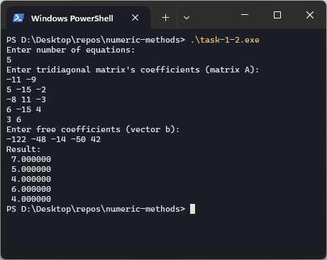

### Итерационные методы решения СЛАУ

Итерационные методы позволяют решать СЛАУ поэтапно. На каждом этапе решение рассматриваемой системы становится все более точным. Для дальнейшего рассмотрения итерационных методов, рассмотрим СЛАУ

$$
\left\lbrace \begin{matrix}
    a_{11} \cdot x_1 + a_{12} \cdot x_2 + \ldots + a_{1n} \cdot x_n = b_1 \\
    a_{21} \cdot x_1 + a_{22} \cdot x_2 + \ldots + a_{2n} \cdot x_n = b_1 \\
    \ldots \\
    a_{2n} \cdot x_1 + a_{n2} \cdot x_2 + \ldots + a_{nn} \cdot x_n = b_n \\
\end{matrix} \right.
$$

где матрица коэффициентов является невырожденной.

Приведем СЛАУ к следующему виду путем эквивалентных преобразований

$$
\left\lbrace \begin{matrix}
    x_1 = \beta_1 + \alpha_{11} \cdot x_1 + \alpha_{12} \cdot x_2 + \ldots + \alpha_{1n} \cdot x_n \\
    x_2 = \beta_1 + \alpha_{21} \cdot x_1 + \alpha_{22} \cdot x_2 + \ldots + \alpha_{2n} \cdot x_n \\
    \ldots \\
    x_2 = \beta_1 + \alpha_{21} \cdot x_1 + \alpha_{22} \cdot x_2 + \ldots + \alpha_{2n} \cdot x_n \\
\end{matrix} \right.
$$

или в векторно-матричной форме $x = \beta + \alpha \cdot x$. Мы получили общий вид решения системы уравнений с помощью итерационных методов

$$
\left\lbrace \begin{matrix}
    x ^ {(0)} = \beta \\
    x ^ {(1)} = \beta + \alpha \cdot x ^ {(0)} \\
    x ^ {(2)} = \beta + \alpha \cdot x ^ {(1)} \\
    \ldots \\
    x ^ {(k)} = \beta + \alpha \cdot x ^ {(k - 1)} \\
\end{matrix} \right.
$$

Однако, при таком определении мы сталкиваемся с проблемой бесконечного поиска решения СЛАУ. В этом случае применяют критерий окончания итерационного процесса. Например, им может послужить неравенство

$$
\left| x ^ {(k)} - x ^ {(k + 1)} \right| \le \varepsilon
$$

В итоге, задача сводится к определению элементов $\beta$, $\alpha$. Одним из наиболее распространенных является следующий. Разрешим систему относительно неизвестных при ненулевых диагональных элементах $a_{ii} \ne 0, i = \overline{1, n}$ (если какой-либо коэффициент на главной диагонали равен нулю, достаточно соответствующее уравнение поменять местами с любым другим уравнением). Получим следующие выражения для компонентов вектора $\beta$ и матрицы $\alpha$ эквивалентной системы:

$$
\begin{matrix}
    \beta_i = \frac{b_i}{a_{ii}} \\
    \alpha_{ij} = - \frac{a_{ij}}{a_{ii}}, i \ne j; a_{ij} = 0, i = j \\
\end{matrix}
$$

В итоге мы пришли к определению одного из методов итераций - методу простых итераций. Его достаточным условием сходимости является диагональное преобладание матрицы $A$ по строкам или по столбцам:

$$
\left| a_{ii} \right| > \sum_{j = 1, i \ne j} ^ {n} \left| a_{ij} \right|
$$

Одним из недостатков метода простых итераций является его довольно медленная сходимость. Для решения этой проблемы используют **метод Зейделя**, заключающийся в том, что при вычислении компонента $x_i ^ {k + 1}$ вектора неизвестных на $(k + 1)$-й итерации используются $x_1 ^ {k + 1}, x_2 ^ {k + 1}, \ldots, x_{i - 1} ^ {k + 1}$, уже вычисленные на $(k + 1)$-й итерации. Тогда метод Зейделя для известного вектора на k-ой итерации имеет вид:

$$
\left\lbrace \begin{matrix}
    x_1 ^ {k + 1} = \beta_1 + \alpha_{11} \cdot x_1 ^ {k} + \alpha_{12} \cdot x_2 ^ {k} + \ldots + \alpha_{1n} \dot x_n ^ k \\
    x_2 ^ {k + 1} = \beta_2 + \alpha_{21} \cdot x_1 ^ {k} + \alpha_{22} \cdot x_2 ^ {k} + \ldots + \alpha_{2n} \dot x_n ^ k \\
    x_3 ^ {k + 1} = \beta_3 + \alpha_{31} \cdot x_1 ^ {k} + \alpha_{32} \cdot x_2 ^ {k} + \ldots + \alpha_{3} \dot x_n ^ k \\
    \ldots \\
    x_n ^ {k + 1} = \beta_n + \alpha_{n1} \cdot x_1 ^ {k} + \alpha_{n2} \cdot x_2 ^ {k} + \ldots + \alpha_{nn} \dot x_n ^ k \\
\end{matrix} \right.
$$

#### Входные данные

Ниже приведен пример входных данных для решения системы линейный алгебраических уравнений с использованием методов итераций, соответствующий моему варианту

$$
\left\lbrace \begin{matrix}
    29 \cdot x_1 + 8 \cdot x_2 + 9 \cdot x_3 - 9 \cdot x_4 = 197 \\
    -7 \cdot x_1 - 25 \cdot x_2 + 9 \cdot x_4 = -226 \\
    x_1 + 6 \cdot x_2 + 16 \cdot x_3 - 2 \cdot x_4 = -95 \\
    -7 \cdot x_1 + 4 \cdot x_2 - 2 \cdot x_3 + 17 \cdot x_4 = -58 \\
\end{matrix} \right.
$$

#### Реализация метода простых итераций

Ниже предоставлена реализация метода простых реализаций на языке программирования C++

```cpp
struct IterativeMethodResult {
    Matrix::TMatrix result;
    int iterations;
};

float Norm(const Matrix::TMatrix& m) {
    float matrixSum = 0.0;
    float element;
    int n = m.GetSize().first;

    for (int i = 0; i < n; ++i) {
        for (int j = 0; j < n; ++j) {
            element = m.Get(i, j);
            matrixSum += element * element;
        }
    }

    return std::sqrt(matrixSum);
}

void JakobiMethod(const Matrix::TMatrix& A, const Matrix::TMatrix& b, Matrix::TMatrix& alpha, Matrix::TMatrix& beta) {
    int n = A.GetSize().first;
    float diagAlpha;

    for (int i = 0; i < n; ++i) {
        diagAlpha = A.Get(i, i);
        beta.Set(i, 0, b.Get(i, 0) / diagAlpha);

        for (int j = 0; j < n; ++j) {
            alpha.Set(
                i, j,
                (i == j) ? 0.0 : - A.Get(i, j) / diagAlpha
            );
        }
    }
}

void inverseMatrix(const Matrix::TMatrix& m, Matrix::TMatrix& result) {
    int n = m.GetSize().first;
    Matrix::TMatrix l(n, n), u(n, n), p(n, n);

    LUDecompose(m, l, u, p);
    InverseMatrix(l, u, p, result);
}

void SeidelMethod(const Matrix::TMatrix& A, const Matrix::TMatrix& b, Matrix::TMatrix& alpha, Matrix::TMatrix& beta) {
    int n = A.GetSize().first;
    Matrix::TMatrix B(n, n), C(n, n), T(n, n);
    Matrix::TMatrix E = Matrix::TMatrix::Eye(n);

    JakobiMethod(A, b, alpha, beta);

    // split alpha matrix B, C: alpha = B + C
    for (int i = 0; i < n; ++i) {
        for (int j = 0; j < n; ++j) {
            if (j >= i) C.Set(i, j, alpha.Get(i, j));
            else B.Set(i, j, alpha.Get(i, j));
        }
    }

    inverseMatrix(E + B * (-1.0), T);
    alpha = T * C;
    beta = T * beta;
}

float Epsilon(float alphaNorm, const Matrix::TMatrix& x1, const Matrix::TMatrix& x2) {
    float coef = alphaNorm / (1 - alphaNorm);
    Matrix::TMatrix diff = x1 + x2 * (-1.0);
    return coef * Norm(diff);
}

IterativeMethodResult IterativeMethod(const Matrix::TMatrix& alpha, const Matrix::TMatrix& beta, float eps) {
    int n = alpha.GetSize().first;
    float alphaNorm = Norm(alpha);
    int iterations = 0;

    Matrix::TMatrix x = beta;
    Matrix::TMatrix x2 = beta;

    while (true) {
        iterations++;
        x2 = alpha * x + beta;

        if (Epsilon(alphaNorm, x, x2) <= eps) {
            break;
        }

        x = x2;
    }

    return {
        .result=x2,
        .iterations=iterations
    };
}
```

#### Результат

Ниже предоставлен пример работы программы с входными данными, соответствующими моему варианту

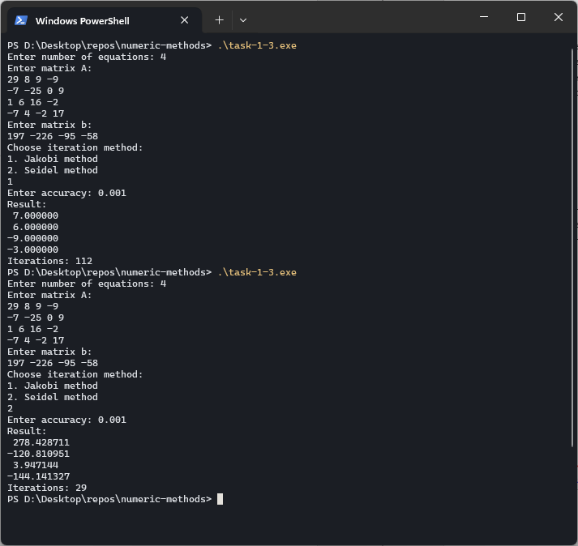

### Метод вращений

Среди численных методов для решения задачи поиска собственных значений матрицы существует метода вращений Якоби. Данный метод имеет ограничения на входящую матрицу в виде симметричности ($A ^ T = A$). Его задачей является решение полной проблемы собственных значений и собственных векторов матриц.

Данный метод основывается на идее итерационном применении преобразований подобия

$$
\Lambda = U ^ {-1} \cdot A \cdot U
$$

поскольку для симметрических матриц $A$ матрица преобразования подобия $U$ является ортогональной ($U ^ {-1} = U ^ T$), то $\Lambda = U ^ T \cdot A \cdot U$, где $\Lambda$ - диагональная матрица с собственными значениями на главной диагонали.

Сформулируем алгоритм работы методы вращений Якоби. Пусть дана симметрическая матрица $A$. Требуется вычислить все собственные значения и соответствующие им собственные векторы с заданной точностью $\varepsilon$.

Пусть известна матрица $A^ {(k)}$ на $k$-й итерации, при этом для $k = 0$: $A ^ {(0)} = A$.

1. На начальной итерации (при $k = 0$) имеем $A ^ {(0)} = A$;

2. На каждой итерации выбирается максимальный по модулю недиагональный элемент $a_{ij} ^ {(k)}$ матрицы $A ^ {(k)}$ ($\left| a_{ij} ^ {(k)} \right| = \max_{l < m} \left| a_{lm} ^ {(k)} \right|$);

3. Ставится задача найти такую ортогональную матрицу $U ^ {(k)}$, чтобы в результате преобразования подобия $A ^ {(k + 1)} = U ^ {(k) T} \cdot A ^ {(k)} \cdot U ^ {(k)}$ произошло обнуление элемента $a_{ij} ^ {(k+1)}$ матрицы $A ^ {(k + 1)}$. В качестве ортогональной матрицы выбирается матрица вращения, имеющая следующий вид:

   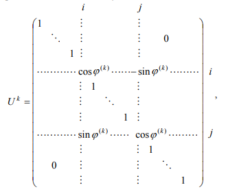

   Угол вращения $\varphi ^ {(k)}$ определяется из условия $a_{ij} ^ {(k + 1)} = 0$:

   $$
   \varphi ^ {(k)} = \frac{1}{2} \cdot \arctg{
       \frac{
            2 \cdot a_{ij} ^ {(k)}
        }{
            a_{ii} ^ {(k)} - a_{jj} ^ {(k)}
        }
   }
   $$

   причем если $a_{ii} ^ {(k)} = a_{jj} ^ {(k)}$, то $\varphi ^ {(k)} = \frac{\pi}{4}$.

4. Строится матрица $A ^ {(k + 1)}$

   $$
   A ^ {(k + 1)} = U ^ {(k) T} \cdot A ^ {(k)} \cdot U ^ {(k)}
   $$

   Так как метод вращений Якоби также является итерационным, то возникает необходимость в определении критерия окончания итерационного процесса. Он имеет следующий вид:

   $$
   t \left( A ^ {(k + 1)} \right) =
   \sqrt{\sum_{l, m; l < m} \left( a_{lm} ^ {(k + 1)} \right) ^ 2}
   $$

   Данное неравенство описывает условие малости суммы квадратов в недиагональных элементах.

#### Входные данные

Ниже приведен пример входных данных для решения задачи поиска собственных значений с использованием метода вращений Якоби, соответствующий моему варианту

$$
\left( \begin{matrix}
    -6 &&  6 && -8 \\
     6 && -4 &&  9 \\
    -8 &&  9 && -2 \\
\end{matrix} \right)
$$

#### Реализация метода вращений Якоби

Ниже предоставлена программная реализация метода вращения Якоби

```cpp
std::pair<int, int> FindMaxNotDiagonalElement(const Matrix::TMatrix& A) {
    int n = A.GetSize().first;
    int maxI = 0, maxJ = 1;
    for (int i = 0; i < n; ++i) {
        for (int j = i + 1; j < n; ++j) {
            if (fabsf(A.Get(i, j)) > fabsf(A.Get(maxI, maxJ))) {
                maxI = i;
                maxJ = j;
            }
        }
    }
    return {maxI, maxJ};
}

float GetRotationAngle(const Matrix::TMatrix& A, int i, int j) {
    float aii = A.Get(i, i), ajj = A.Get(j, j), aij = A.Get(i, j);
    if (aii == ajj) return M_PI / 4.0;
    return 0.5 * atan((2.0 * aij) / (aii - ajj));
}

Matrix::TMatrix GetRotationMatrix(int n, int i, int j, float phi) {
    Matrix::TMatrix U = Matrix::TMatrix::Eye(n);
    float c = cos(phi), s = sin(phi);
    U.Set(i, i, c);
    U.Set(j, j, c);
    U.Set(i, j, -s);
    U.Set(j, i, s);
    return U;
}

Matrix::TMatrix GetNextA(const Matrix::TMatrix& A, const Matrix::TMatrix& U) {
    return Matrix::Transpose(U) * A * U;
}

float t(const Matrix::TMatrix& A) {
    int n = A.GetSize().first;
    float s = 0.0, el;

    for (int i = 0; i < n; ++i) {
        for (int j = i + 1; j < n; ++j) {
            el = A.Get(i, j);
            s += el * el;
        }
    }
    return sqrt(s);
}

EigenTaskResult SolveEigenTask(const Matrix::TMatrix& M, float eps) {
    Matrix::TMatrix A(M);
    int n = A.GetSize().first;
    Matrix::TMatrix U = Matrix::TMatrix::Eye(n);
    EigenTaskResult result;
    result.iterations = 0;

    while (t(A) > eps) {
        std::pair<int, int> pos = FindMaxNotDiagonalElement(A);
        float phi = GetRotationAngle(A, pos.first, pos.second);
        Matrix::TMatrix u = GetRotationMatrix(n, pos.first, pos.second, phi);
        A = GetNextA(A, u);
        U = U * u;
        result.iterations++;
    }

    for (int i = 0; i < n; ++i) {
        result.eigenValues.push_back(A.Get(i, i));
    }

    for (int i = 0; i < n; ++i) {
        Matrix::TMatrix v(n, 1);
        for (int j = 0; j < n; ++j) {
            v.Set(j, 0, U.Get(j, i));
        }
        result.eigenVectors.push_back(v);
    }

    return result;
}
```

#### Результат

Ниже предоставлен пример работы программы с входными данными, соответствующими моему варианту

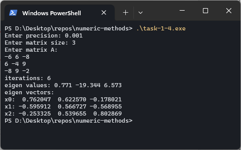

### QR-алгоритм нахождения собственных значений матриц

Также, для решения задачи поиска собственных значений и собственных векторов матрицы может быть применен метод QR-разложения. Его суть заключается в представлении исходной матрицы $A$ в виде следующего произведения

$$
A = Q \cdot R
$$

где $Q$ - ортогональная матрица, а $R$ - верхняя треугольная. Одним из возможных способов построения $QR$ разложения является использование преобразования Хаусхолдера, который позволяет обратить в нуль группу поддиагональных элементов столбца матрицы.

Преобразование Хаусхолдера осуществляется с использованием матрицы Хаусхолдера, имеющей следующий вид:

$$
H = E - \frac{2}{\nu ^ T \cdot \nu}\cdot \nu \cdot \nu ^ T
$$

где $v$ - произвольный ненулевой столбец.

Далее, для решения поставленной задачи, необходимо рассмотреть случай, когда необходимо обратить в нуль все элементы вектора кроме первого. Для этого необходимо построить матрицу Хаусхолдера такую, чтобы она удовлетворяла следующему равенству

$$
\widetilde{b} = H \cdot b
$$

где $\widetilde{b} = \left( \widetilde{b_1},\ 0, \ldots, 0 \right) ^ T $ - столбец $b$, в котором все элементы, кроме первого, стали нулевыми.

В этом случае вектор $\nu$ имеет следующий вид:

$$
\nu = b + sign \left( b_1 \right) \cdot \left| \left| b \right| \right|_2 \cdot e_1
$$

Применяя описанную процедуру для обнуления поддиагональных элементов каждого столбца исходной матрицы, можно за фиксированное количество шагов выполнить ее QR-разложение.

Процедура QR-разложения многократно применяется в QR-алгоритме для вычисления собственных значений. При этом строится следующий
итерационный процесс:

$$
\begin{matrix}
A ^ {(0)} = A \\
A ^ {(0)} = Q ^ {(0)} \cdot R^{(0)} \\
A ^ {(1)} = R ^ {(0)} \cdot Q ^ {(0)} \\
\ldots \\
A ^ {(k)} = Q ^ {(k)} \cdot R ^ {(k)} \\
A ^ {(k + 1)} = R ^ {(k)} \cdot Q ^ {(k)} \\
\end{matrix}
$$

Таким образом, каждая итерация выполняется в два этапа. На первом этапе матрица $A ^ {(k)}$ разлагается на произведение ортогональной матрицы $Q ^ {(k)}$ и верхней треугольной матрицы $R ^ {(k)}$. На втором этапе эти матрицы перемножаются в обратном порядке.

Если у матрицы нет кратных собственных значений, последовательность $A ^ {(k)}$ сходится к верхней треугольной матрице (если все собственные значения вещественные) или к верхней квазитреугольной матрице (если имеются комплексно-сопряженные пары собственных значений).

Таким образом, каждому вещественному собственному значению будет соответствовать столбец с поддиагональными элементами, стремящимися к нулю. В качестве критерия сходимости итерационного процесса для таких собственных значений можно использовать следующее неравенство:

$$
\sqrt{\sum_{l = m + 1} ^ n \left( a_{lm} ^ {(k)} \right)^{2}} \leq \varepsilon
$$

#### Входные данные

Ниже приведен пример входных данных для решения задачи поиска собственных значений с использованием метода $QR$-разложения,
соответствующий моему варианту

$$
\left( \begin{matrix} 
     9 &&  0 && 2 \\
    -6 &&  4 && 4 \\
    -2 && -7 && 5 \\
\end{matrix} \right)
$$

#### Реализация

Ниже предоставлена программная реализация алгоритма $QR$-разложения. Она также включает в себя вычисление матрицы Хаусхолдера.

```cpp
using ComplexPair = std::pair<std::complex<float>, std::complex<float>>;

using EigenValues = std::vector<std::complex<float>>;

using ChangeHistory = std::vector<float>;

const int HISTORY_SIZE = 5;

void GetHouseholderMatrix(const Matrix::TMatrix& A, int i, Matrix::TMatrix& H) {
    int n = A.GetSize().first;
    Matrix::TMatrix v(n, 1);

    for (int j = 0; j < n; ++j) {
        if (j < i) {
            v.Set(j, 0, 0);
        }

        else if (j > i) {
            v.Set(j, 0, A.Get(j, i));
        }

        else {
            float aDiag = A.Get(i, i);
            float signA = float((aDiag > 0) - (aDiag < 0));
            float sum = 0.0;

            for (int t = j; t < n; ++t) {
                sum += A.Get(t, i) * A.Get(t, i);
            }

            v.Set(
                j, 0,
                aDiag + signA * sqrt(sum)
            );
        }
    }

    float k = (Matrix::Transpose(v) * v).Get(0, 0);
    H = v * Matrix::Transpose(v) * (-2.0 / k) + Matrix::TMatrix::Eye(n);
}

void QRDecompose(const Matrix::TMatrix& A, Matrix::TMatrix& Q, Matrix::TMatrix& R) {
    int n = A.GetSize().first;
    Matrix::TMatrix H(n, n);
    Q = Matrix::TMatrix::Eye(n);
    R = A;

    for (int i = 0; i < n - 1; ++i) {
        GetHouseholderMatrix(R, i, H);
        Q = Q * H;
        R = H * R;
    }
}

ComplexPair FindComplexEigeValues(const Matrix::TMatrix& A, int i) {
    float a1 = A.Get(i, i), a2 = A.Get(i + 1, i + 1);
    float a3 = A.Get(i + 1, i), a4 = A.Get(i, i + 1);
    float b = - a1 - a2;
    float c = a1 * a2 - a3 * a4;
    float d = b * b - 4.0 * c;

    std::complex<float> dSqrt = std::sqrt(std::complex<float>(d, 0));
    std::complex<float> bComplex = std::complex<float>(b, 0.0);
    std::complex<float> k = 0.5;

    return { k * (-bComplex + dSqrt), k * (-bComplex - dSqrt) };
}

bool tReal(const Matrix::TMatrix& A, int i, int j, float eps) {
    int n = A.GetSize().first;
    float sum = 0.0;
    for (int t = j; t < n; ++t) {
        sum += A.Get(t, i) * A.Get(t, i);
    }

    return std::sqrt(sum) <= eps;
}

float tComplex(const Matrix::TMatrix& Ai, int i, float eps) {
    int n = Ai.GetSize().first;

    Matrix::TMatrix Q(n, n), R(n, n);
    QRDecompose(Ai, Q, R);
    Matrix::TMatrix ANext = R * Q;

    ComplexPair lambda1 = FindComplexEigeValues(Ai, i);
    ComplexPair lambda2 = FindComplexEigeValues(ANext, i);

    return (std::abs(lambda2.first - lambda1.first) <= eps) && (std::abs(lambda2.second - lambda1.second) <= eps);
}

bool IsEigenValueReal(const ChangeHistory& history) {
    int startIndex = std::max(1, int(history.size()) - HISTORY_SIZE);

    for (int i = startIndex; i < history.size(); ++i) {
        if (history[i] >= history[i - 1]) {
            return false;
        }
    }

    return true;

}

void UpdateChangeHistory(const Matrix::TMatrix& A, std::vector<ChangeHistory>& history) {
    int n = A.GetSize().first;

    for (int i = 0; i < n - 1; ++i) {
        history[i].push_back(std::abs(A.Get(i + 1, i)));
    }
}

EigenValues GetEigenValues(const Matrix::TMatrix& A, float eps) {
    int n = A.GetSize().first;

    Matrix::TMatrix Q(n, n), R(n, n);
    Matrix::TMatrix Ai = A;
    EigenValues values;

    std::vector<std::vector<float>> history(n);
    int i = 0;

    while (i < n) {
        QRDecompose(Ai, Q, R);
        Ai = R * Q;
        UpdateChangeHistory(Ai, history);

        if (tReal(Ai, i, i + 1, eps)) {
            values.push_back(Ai.Get(i, i));
            i++;
        } else if (tComplex(Ai, i, eps) && tReal(Ai, i, i + 2, eps)) {
            ComplexPair p = FindComplexEigeValues(Ai, i);
            values.push_back(p.first);
            values.push_back(p.second);
            i += 2;
        }
    }

    return values;
}
```

#### Результат

Ниже предоставлен пример работы программы с входными данными,
соответствующими моему варианту

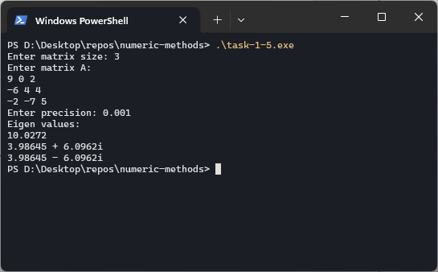

## Лабораторная работа №2

### О программе

Для решения данной лабораторной работы были написаны программы на языке Python с использованием библиотек numpy и PyQt для графического интерфейса.

### Запуск программ

Для запуска программ необходимо установить перечисленные выше библиотеки и выполнить команду `python -m lab_2.task_{n}.app`, где `n` - номер задания в лабораторной работе.

### Решение нелинейных уравнений

Рассмотрим задачу решения трансцендентного уравнения $f(x) = 0$. Используя метод простой итерации, можно эффективно находить корни этого уравнения. Предположим, что корень находится на отрезке $[a, b]$, и функция $f(x)$ удовлетворяет следующим условиям:

1. на концах отрезка функция имеет разные знаки;
2. $\forall x \in [a; b] \ f'(x) \ne 0$
3. первая и вторая производные имеют постоянные знаки.

Для построения итерационного процесса уравнение $f(x) = 0$ заменяется эквивалентным уравнением $x = \varphi(x)$, где $\varphi(x)$ - непрерывная функция. Выберем начальное приближение $x ^ {(0)}$ и организуем итерационный процесс по следующей схеме:

$$
x ^ {(k + 1)} = \varphi \left( x ^ {(k)} \right)
$$

Условие $\left| \varphi ' (x) \right| \le q < 1$ для всех $x \in [a, b]$ гарантирует сходимость итерационного процесса, если начальное приближение выбрано вблизи корня.

Также, для решения этой же задачи можно воспользоваться методом Ньютона. Для построения итерационного процесса этим методом функция $f(x)$, непрерывная на интервале $x \in [a, b]$, должна удовлетворять условиям, аналогичным тем, что применяются в методе итераций.

Правило построения итерационной последовательности основано на замене нелинейной функции $f(x)$ её линейной моделью, используя формулу Тейлора. Выберем две соседние точки в окрестности корня, так что $x ^ {(k+1)}  = x ^ {(k)} + \varepsilon$, и запишем разложение функции в ряд Тейлора:

$$
f \left( x ^ {(k + 1)} \right) =
f \left( x ^ {(k)} \right) + 
f' \left( x ^ {(k)} \right) \left( x ^ {(k + 1)} - x ^ {(k)} \right) +
\frac{1}{2} \cdot
f'' \left( x ^ {(k)} \right)
\left( x ^ {(k + 1)} - x ^ {(k)} \right) ^ 2 + \ldots
$$

Полагая, что $f \left( x ^ {(k + 1)} \right) \approx 0$ и оставляя только линейную часть разложения, получаем соотношение метода Ньютона:

$$
x ^ {(k + 1)} = x ^ {(k)} -
\frac{f(x ^ {(k)})}{f'(x ^ {(k)})}
$$

Используя условие сходимости метода простых итераций, можно получить достаточное условие сходимости метода Ньютона в форме:

$$
\left| f(x) \cdot f''(x) \right| < (f'(x)) ^ 2, \ \
x \in [a, b]
$$

Для выбора начального приближения $x ^ {(0)}$ используется теорема, согласно которой в качестве начального приближения нужно выбрать тот конец интервала, где знак функции совпадает со знаком второй производной:

$$
x ^ {(0)} =\left\lbrace \begin{matrix}
    a, && \text{если} \ f(a) \cdot f''(a) > 0
    b, && \text{если} \ f(b) \cdot f''(b) > 0
\end{matrix} \right.
$$

Для завершения итерационного процесса используется следующий критерий:

$$
\left| x ^ {(k + 1)} - x ^ {(k)} \right| < \varepsilon
$$

#### Входные данные

Ниже приведен пример входных данных для решения задачи поиска решения уравнения вида $f(x) = 0$ с использованием методов Ньютона и метода простых итераций, соответствующий моему варианту

$$
2 ^ {x} + x ^ 2 - 2 = 0
$$

#### Реализация метода простых итераций и Ньютона

Ниже предоставлена программная реализация метода простых итераций и Ньютона

```python
class MethodResult(NamedTuple):
    x: float
    iterations: int

def _derivative(f: Function) -> Function:
    DX = 0.00001
    return lambda x: (f(x + DX) - f(x)) / DX

def _sign(x: float) -> float:
    if x == 0.0:
        return 0.0
    if x < 0.0:
        return -1.0
    return 1.0

def _build_phi(f: Function, a: float, b: float) -> Function:
    df = _derivative(f)
    max_df = max_value(lambda x: abs(df(x)), a, b)
    sign_f = _sign(df(a))
    return lambda x: x - (sign_f / max_df) * f(x)

def iterations_method(f: Function, a: float, b: float, eps: float, iterations: int) -> MethodResult:
    x0 = (a + b) / 2.0
    phi = _build_phi(f, a, b)
    dphi = _derivative(phi)
    q = max_value(lambda x: abs(dphi(x)), a, b)

    last_x = x0
    i = 0

    while i <= iterations:
        x = phi(last_x)
        if abs(x - last_x) <= (1 - q) / q * eps:
            return MethodResult(x, i)
        last_x = x
        i += 1

    return MethodResult(last_x, i)

def newton_method(f: Function, a: float, b: float, eps: float, iterations: int) -> MethodResult:
    x0 = (a + b) / 2.0
    last_x = x0
    df = _derivative(f)
    i = 0

    while i <= iterations:
        x = last_x - f(last_x) / df(last_x)
        if abs(x - last_x) <= eps:
            return MethodResult(x, i)
        last_x = x
        i += 1

    return MethodResult(last_x, i)
```

#### Результат

Ниже предоставлен пример работы программы с входными данными, соответствующими моему варианту

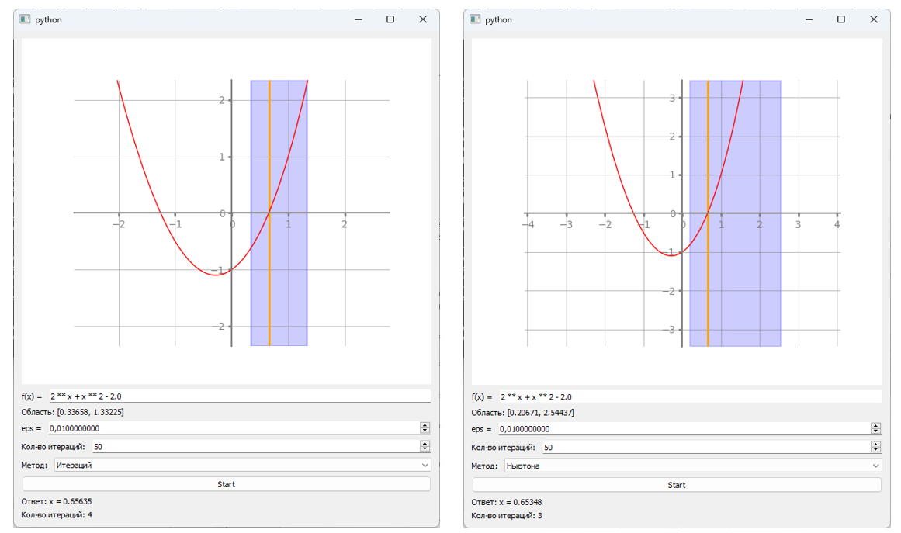

### Решение систем нелинейных уравнений

Задача решения системы нелинейных уравнений можно описать в виде решения следующей системы

$$
\left\lbrace \begin{matrix}
    f_1 (x_1, x_2, x_3, \ldots, x_n) = 0 \\
    f_2 (x_1, x_2, x_3, \ldots, x_n) = 0 \\
    \ldots \\
    f_n (x_1, x_2, x_3, \ldots, x_n) = 0 \\
\end{matrix} \right.
$$

где все функции системы непрерывны и дифференцируемы вблизи решения.

Аналогично с решением одного уравнения, используя метод простых итераций, мы можем записать уравнение в следующий эквивалентный вид

$$
\left\lbrace \begin{matrix}
    x_1 = \varphi_1 (x_1, x_2, x_3, \ldots, x_n) \\
    x_2 = \varphi_2 (x_1, x_2, x_3, \ldots, x_n) \\
    \ldots \\
    x_n = \varphi_n (x_1, x_2, x_3, \ldots, x_n) \\
\end{matrix} \right.
$$

Тогда, на основе начального приближения $x ^ {(0)} = \left( x_1^{(0)}, x_2^{(0)}, \ldots, x_n^{(0)} \right)$ можно построить решение системы нелинейных уравнений методом простых итераций по следующей схеме

$$
\left\lbrace \begin{matrix}
    x_1 ^ {(k + 1)} = \varphi_1 \left( x_1^{(k)}, x_2^{(k)}, x_3^{(k)}, \ldots, x_n^{(k)} \right) \\
    x_2 ^ {(k + 1)} = \varphi_2 \left( x_1^{(k)}, x_2^{(k)}, x_3^{(k)}, \ldots, x_n^{(k)} \right) \\
    \ldots \\
    x_n ^ {(k + 1)} = \varphi_n \left( x_1^{(k)}, x_2^{(k)}, x_3^{(k)}, \ldots, x_n^{(k)} \right) \\
\end{matrix} \right.
$$

На практике используют следующий критерий окончания итерации для данного метода

$$
J(x ^ {(k)}) =
\left[ \frac{\partial \varphi_i (x^{(k)})}{\partial x_j} \right]; \ \

\left| \left| J(x ^ {(k)}) \right| \right| \le q < 1
$$

Это условие описывает то, что метод простых итераций сходится к решению, если какая-либо норма матрицы Якоби $J(x ^ {(k)})$, построенная по правым частям $\varphi_i$ эквивалентной системы в замкнутой области $G$, меньше единицы на каждой итерации.

Также, часто используют матричную форму этого критерия

$$
\max_{x \in G} \left| \left| \varphi'(x) \right| \right| =
\max_{x \in G}\left\lbrace \max_{i} \sum_{j = 1}^{n} \left| \frac{\partial \varphi_i (X)}{ \partial x_j} \right| \right\}
$$

Или, если вычисление этого критерия затруднительно:

$$
\left| x ^ {(k + 1)} - x ^ {(k)} \right| < \varepsilon
$$

Как и в случае с решением одного уравнения, метод Ньютона отличается от метода простых итераций определением перехода к следующему решению. В метод Ньютона он имеет вид:

$$
x ^ {(k + 1)} = x ^ {(k)} - J ^ {-1} (x ^ {(k)}) \cdot f(x ^ {(k)})
$$

где $J(x ^ {(k)})$ - матрица Якоби, имеющая вид:

$$
J(x^{(k)}) = \left| \begin{matrix}
    \frac{\partial f_1(x^{(k)})}{\partial x_1} && \frac{\partial f_1(x^{(k)})}{\partial x_2} && \ldots && \frac{\partial f_1(x^{(k)})}{\partial x_n} \\
    \frac{\partial f_2(x^{(k)})}{\partial x_1} && \frac{\partial f_2(x^{(k)})}{\partial x_2} && \ldots && \frac{\partial f_2(x^{(k)})}{\partial x_n} \\
    \ldots && \ldots && \ldots && \ldots \\
    \frac{\partial f_n(x^{(k)})}{\partial x_1} && \frac{\partial f_n(x^{(k)})}{\partial x_2} && \ldots && \frac{\partial f_n(x^{(k)})}{\partial x_n} \\
\end{matrix} \right|
$$

В практических вычислениях в качестве условия окончания итераций обычно используют критерий, выполняющийся для всех переменных системы:

$$
\left| x ^ {(k + 1)} - x ^ {(k)} \right| < \varepsilon
$$

#### Входные данные

Ниже приведен пример входных данных для решения задачи поиска решения системы нелинейных уравнений с использованием методов Ньютона и метода простых итераций, соответствующий моему варианту

$$
\left\lbrace \begin{matrix}
    x_1^2 + x_2^2 - a^2 = 0, \\
    x_1 - e^{x_2} + a = 0
\end{matrix} \right.
$$

где значение параметра $a = 2$.

#### Реализация метода простых итераций и Ньютона

Ниже предоставлена программная реализация метода простых итераций и Ньютона для решения системы нелинейных уравнений

```python
class MethodResult(NamedTuple):
    x: np.ndarray[float]
    iterations: int

class VectorFunction(np.ndarray):
    def __new__(cls, input_array) -> "VectorFunction":
        obj = np.asarray(input_array).view(cls)
        return obj

    def __call__(self, x: Vector) -> Vector:
        return np.array([func(x) for func in self])

def _sign(x: float) -> float:
    if x == 0.0:
        return 0.0
    if x < 0.0:
        return -1.0
    return 1.0

def _partial_derivative(f: MultiArgFunction, arg_index: int) -> MultiArgFunction:
    dx = 0.0001

    def _df(x):
        n = len(x)
        x2 = x + np.array([dx if i == arg_index else 0.0 for i in range(n)])
        return (f(x2) - f(x)) / dx

    return _df

def _derivative(f: MultiArgFunction, n: int) -> VectorFunction:
    return VectorFunction([_partial_derivative(f, i) for i in range(n)])

def _jakobi_matrix(f: VectorFunction) -> VectorFunction:
    n = len(f)
    return VectorFunction([_derivative(el, n) for el in f])

def _norm(matrix: Vector) -> float:
    return abs(matrix).max()

def _build_phi(f: VectorFunction, n: int, index: int, s1: Vector, s2: Vector) -> MultiArgFunction:
    f_el = f[index]
    df = _derivative(f_el, n)
    pdf = _partial_derivative(f_el, index)
    f_sign = _sign(pdf(s1))
    mx = max_value(lambda x: _norm(df(x)), s1, s2)
    return lambda x: x[index] - (f_sign / mx) * f_el(x)

def _solve_system(A: Matrix, b: Vector) -> Vector:
    l, u, p = task_1.lu_decompose(A)
    return task_1.solve_system(l, u, p, b)

def iteration_method(f: MultiArgFunction, s1: Vector, s2: Vector, eps: float, iterations: int) -> MethodResult:
    n = len(f)
    phi = VectorFunction([_build_phi(f, n, i, s1, s2) for i in range(n)])
    last_x = (s1 + s2) / 2.0
    i = 0

    while i <= iterations:
        x = phi(last_x)
        if _norm(x - last_x) <= eps:
            return MethodResult(x, i)
        last_x = x
        i += 1

    return MethodResult(last_x, i)

def newton_method(f: MultiArgFunction, s1: Vector, s2: Vector, eps: float, iterations: int) -> MethodResult:
    J = _jakobi_matrix(f)
    last_x = (s1 + s2) / 2.0
    i = 0

    while i <= iterations:
        dx = _solve_system(J(last_x), -f(last_x))
        x = last_x + dx

        if _norm(x - last_x) <= eps:
            return MethodResult(x, i)

        last_x = x
        i += 1

    return MethodResult(last_x, i)
```

#### Результат

Ниже предоставлен пример работы программы с входными данными, соответствующими моему варианту

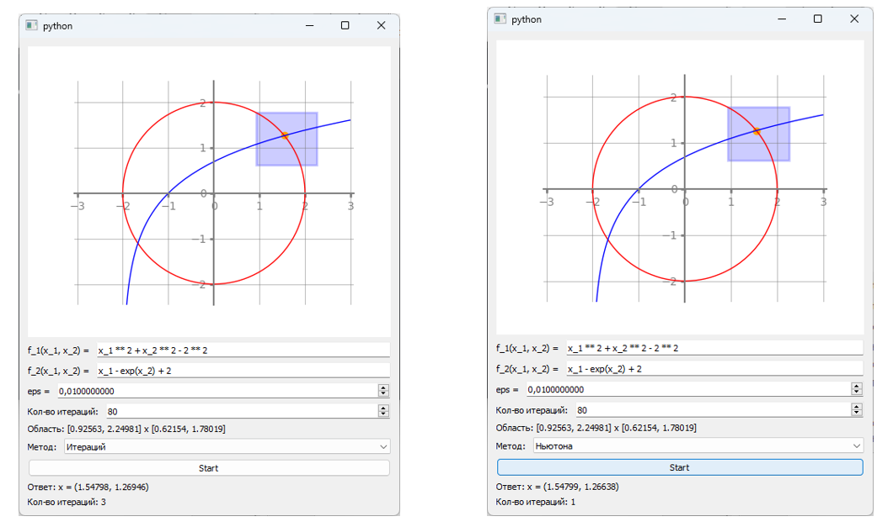

## Лабораторная работа №3

### Описание программы

Для решения текущей лабораторной работы была написана программа на языке Python с применением таких библиотек как scipy, numpy, PyQt и matplotlib.

### Запуск программ

Для запуска программ необходимо установить все вышеперечисленные библиотеки и ввести команду `python -m lab_3.task_{n}`, где `n` - номер задания лабораторной работы.

### Интерполяция

Рассмотрим множество различных точек $x_i$ на отрезке $[a; b]$, где известны значения функции $f_i  = f(x_i)$. Приближающая функция $\varphi(x, a)$, для которой выполняются условия $\varphi(x_i, a_0, \ldots, a_n) = f(x_i)$, называется интерполяционной функцией.

Чаще всего в качестве такой функции используют многочлены степени $n$, имеющие вид:

$$
P_n(x) = \sum_{i = 0}^{n} a_i \cdot x^{i}
$$

Произвольный многочлен можно представить следующим образом:

$$
L_n(x) = \sum_{i = 0}^{n} f_i \cdot l_i(x)
$$

где $l_i(x)$ - многочлены степени $n$, которые называются лагранжевыми многочленами влияния. Они удовлетворяют условию:

$$
l_i(x_j) =\left\lbrace
    \begin{matrix}
        1, && \text{если} \ i = j \\
        0, && \text{иначе} \\
    \end{matrix}
\right.
$$

Лагранжевые многочлены влияния $l_i(x)$ определяются как:

$$
l_i(x) = \prod_{j = 0, j \ne i}^{n} \frac{(x - x_i)}{(x_i - x_j)}
$$

Таким образом, интерполяционный многочлен Лагранжа имеет вид:

$$
L_n(x) = \sum_{i = 0}^{n} f_i \cdot \prod_{j = 0, j \ne i}^{n} \frac{(x - x_i)}{(x_i - x_j)}
$$

Основным недостатком многочлена Лагранжа является необходимость пересчета всех коэффициентов при добавлении новых интерполяционных узлов. Чтобы избежать этого недостатка, используют интерполяционный многочлен Ньютона.

Разделенные разности нулевого порядка совпадают со значениями функции в узлах. Разделенные разности первого порядка обозначаются $f(x_i, x_j)$ и определяются через разделенные разности нулевого порядка:

$$
f(x_i, x_j) = \frac{f_i - f_j}{x_i - x_j}
$$

Разделенные разности второго порядка определяются через разности первого порядка:

$$
f(x_i, x_j, x_k) = \frac{f(x_i, x_j) - f(x_j, x_j)}{(x_j - x_k)}
$$

Разделенная разность n-го порядка определяется рекурсивно:

$$
f(x_i, x_j, x_k, \ldots, x_{n - 1}, x_n) =
\frac{f(x_i, x_j, x_k, \ldots, x_{n - 1}) - f(x_j, x_k, \ldots, x_n)}{x_i - x_n}
$$

Интерполяционный многочлен Ньютона имеет вид:

$$
P_n(x) = f(x_0) - (x - x_0) \cdot f(x_1, x_0) + (x - x_0) \cdot (x - x_1) \cdot f(x_0, x_1, x_2) +
\ldots + (x - x_0) \cdot (x - x_1) \ldots (x - x_n) \cdot f(x_0, x_1, \ldots, x_n)
$$

При добавлении новых узлов, начальные члены многочлена Ньютона остаются неизменными. Для повышения точности интерполяции могут быть добавлены новые члены, что требует подключения дополнительных интерполяционных узлов, причём порядок их добавления не имеет значения. Это является преимуществом многочлена Ньютона по сравнению с многочленом Лагранжа.

#### Входные данные

Ниже приведен пример входных данных для решения задачи интерполяции функции с использованием интерполяционных многочленов Лагранжа и Ньютона, соответствующий моему варианту.

$$
\begin{matrix}
    y = \sqrt{x}; X ^ {\star} = 3.0 \\
    \text{a)} \ X_i = 0, 1.7, 3.4, 5.1; \
    \text{б)} \ X_i = 0, 1.7, 4.0, 5.1 \\
\end{matrix}
$$

#### Реализация интерполяционных многочленов Лагранжа и Ньютона

Ниже предоставлена программная реализация интерполяционных многочленов Лагранжа и Ньютона. Данные методы интерполяции были представлены в виде классов, которые принимают на вход координаты узлов и поддерживают интерфейс вызываемых (Callable) объектов для того, чтобы их можно было использовать как функции.

```python
class LagrangeInterpolationPolynomial:
    def __init__(self, nodes: list[tuple[float, float]]):
        self._x, self._y = zip(*nodes) if nodes else ([], [])

    def l(self, i: int, x: float) -> float:
        value = 1.0
        for j in range(len(self._x)):
            if j == i:
                continue
            value *= (x - self._x[j]) / (self._x[i] - self._x[j])
        return value

    def __call__(self, x: float) -> float:
        value = 0.0
        for i in range(len(self._x)):
            value += self._y[i] * self.l(i, x)
        return value

class NewtonInterpolationPolynomial:
    def __init__(self, nodes: list[tuple[float, float]]):
        x, y = zip(*nodes) if nodes else ([], [])
        self._diffs = self._count_differences(x, y)
        self._x = x

    @staticmethod
    def _count_differences(x: list[float], y: list[float]) -> list[list[float]]:
        n = len(x)
        diffs = [[] for _ in range(n)]

        for i in range(n):
            if i == 0:
                diffs[0] = y
            else:
                for j in range(n - i):
                    diffs[i].append(
                        (diffs[i - 1][j] - diffs[i - 1][j + 1]) / (x[j] - x[j + i])
                    )

        return diffs

    def __call__(self, x: float) -> float:
        value = 0.0

        for i in range(len(self._x)):
            coef = 1.0
            for j in range(i):
                coef *= x - self._x[j]
            coef *= self._diffs[i][0]
            value += coef

        return value
```

#### Результат

Ниже предоставлен пример работы программы с входными данными, соответствующими моему варианту

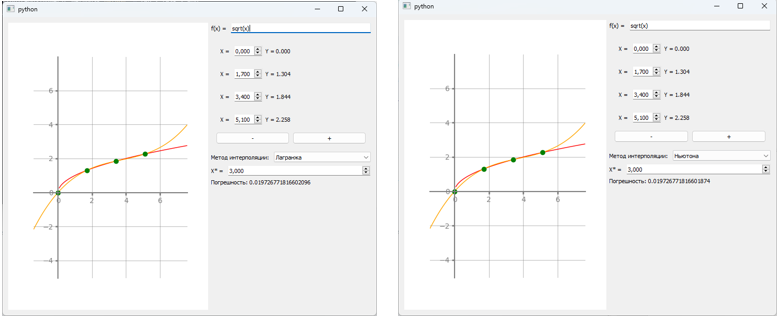

### Сплайн-интерполяция

Применение одной интерполяционной формулы на большом количестве узлов может оказаться неэффективным. Интерполяционный многочлен может проявлять значительные колебания, и его значения между узлами могут сильно отклоняться от значений самой функции. Для решения этой проблемы используется сплайн-интерполяция.

Суть метода заключается в использовании различных интерполяционных функций для непересекающихся промежутков, с обеспечением стыковки значений функции и её производных на границах этих промежутков.

Наиболее распространённым является случай, когда между двумя соседними точками отрезка строится многочлен степени $n$:

$$
S(x) = \sum_{k = 0}^{n} a_{ik} \cdot x ^ {k}, \
x_{i - 1} \le x \le x_i, \
i = \overline{1, n}
$$

В узлах интерполяции этот многочлен принимает значения аппроксимируемой функции и остаётся непрерывным вместе со своими производными до порядка $n - 1$. Такой кусочно-непрерывный интерполяционный многочлен называется сплайном. Коэффициенты сплайна определяются из условий равенства в узлах значений сплайна и исходной функции, а также равенства производных до порядка $n - 1$.

На практике часто используется кубический сплайн, который удобно записать в виде:

$$
S(x) = a_i + b_i \cdot (x_i - x_{i - 1}) + c_i \cdot (x - x_{i - 1}) ^ 2 + d_i \cdot (x - x_{i - 1}) ^ 3
$$

где $x_{i - 1} \le x \le x_i, \ i = \overline{1, n}$

Для построения кубического сплайна необходимо определить $n$ многочленов третьей степени, что требует нахождения $4 \cdot n$ неизвестных коэффициентов $a_i, b_i, c_i, d_i$. Эти коэффициенты вычисляются на основе условий в узловых точках.

#### Входные данные

Ниже приведен пример входных данных для решения задачи интерполяции функции с использованием Сплайн-интерполяции, соответствующий моему варианту.

| $i$   | 0   | 1      | 2      | 3      | 4      |
|-------|-----|--------|--------|--------|--------|
| $x_i$ | 0.0 | 1.7    | 3.4    | 5.1    | 6.8    |
| $f_i$ | 0.0 | 1.3038 | 1.8439 | 2.2583 | 2.6077 |

$$
X^{\star} = 3.0
$$

#### Реализация интерполяционных многочленов Лагранжа и Ньютона

Ниже предоставлена программная реализация Сплайн-интерполяции. Данный метод интерполяции был представлен в виде класса, который принимает на вход координаты узлов и поддерживает интерфейс вызываемых (Callable) объектов для того, чтобы его можно было использовать как функцию.

```python
class CubicSplineInterploation:
    def __init__(self, nodes: list[tuple[float, float]]):
        x, f = map(np.array, zip(*nodes))
        h = self._get_h(x)
        self.c = self._get_coef_c(h, f)
        self.a = self._get_coef_a(f)
        self.b = self._get_coef_b(h, self.c, f)
        self.d = self._get_coef_d(h, self.c)
        self.x = x

    def __call__(self, x: float) -> float:
        for i in range(1, len(self.x)):
            if self.x[i - 1] <= x <= self.x[i]:
                h = x - self.x[i - 1]
                return self.a[i] + self.b[i] * h + self.c[i] * h**2 + self.d[i] * h**3
        return np.nan

    @classmethod
    def _get_h(cls, x):
        n = len(x) - 1
        return np.array(
            [0] + [x[i] - x[i - 1] for i in range(1, n + 1)],
            dtype=np.float32,
        )

    @classmethod
    def _get_coef_c(cls, h, f):
        A, B = cls._get_system_coefs(h, f)
        c = np.zeros_like(h)
        c[2:] = solve_system(A, B)
        return c

    @classmethod
    def _get_coef_a(cls, f):
        a = np.zeros_like(f)
        a[1:] = f[:-1]
        return a

    @classmethod
    def _get_coef_b(cls, h, c, f):
        n = len(f) - 1
        b = np.zeros(n + 1)

        for i in range(1, n):
            b[i] = (f[i] - f[i - 1]) / h[i] - (h[i] * (c[i + 1] + 2 * c[i])) / 3.0
        b[n] = (f[n] - f[n - 1]) / h[n] - 2.0 / 3.0 * h[n] * c[n]

        return b

    @classmethod
    def _get_coef_d(cls, h, c):
        n = len(c) - 1
        d = np.zeros(n + 1)

        for i in range(1, n):
            d[i] = (c[i + 1] - c[i]) / (3.0 * h[i])
        d[n] = -c[n] / (3.0 * h[n])
        return d

    @classmethod
    def _get_system_coefs(cls, h, f):
        n = len(f) - 1
        A = np.zeros((n - 1, 3))
        B = np.zeros((n - 1, 1))

        for i in range(2, n + 1):
            a, b, c = h[i - 1], 2 * (h[i - 1] + h[i]), h[i]
            d = 3 * ((f[i] - f[i - 1]) / h[i] - (f[i - 1] - f[i - 2]) / h[i - 1])

            if i == 2:
                A[i - 2, :] = 0, b, c
            elif i == n:
                A[i - 2, :] = a, b, 0
            else:
                A[i - 2, :] = a, b, c
            B[i - 2, 0] = d

        return A, B
```

#### Результат

Ниже предоставлен пример работы программы с входными данными, соответствующими моему варианту

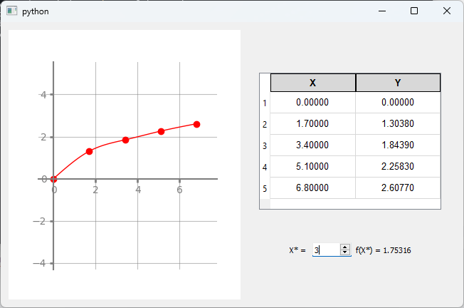

### Метод наименьших квадратов

Метод наименьших квадратов является одним из численных методов решения задачи аппроксимации функций. Предположим, у нас есть набор точек $(x_i, y_i)$, где значения $y_i$ имеют некоторую погрешность. Наша задача - найти многочлен $F_n(x)$, который наилучшим образом приближает эти точки.

Мы знаем, что $F_n(x)$ может быть представлена как многочлен степени $n$ с неизвестными коэффициентами $a_i$. Для нахождения этих коэффициентов мы стремимся минимизировать квадратичное отклонение между значениями многочлена и фактическими значениями $y_i$. Это приводит к функции ошибки $\Phi$, которую мы хотим минимизировать:

$$
\Phi = \sum_{j = 0}^{n} \left[ F_n(x_j) - y_i \right] ^ 2
$$

Чтобы найти минимум функции $\Phi$, мы используем необходимое условие экстремума, которое приводит нас к нормальной системе уравнений метода наименьших квадратов:

$$
\sum_{i = 0}^{n} a_i \cdot \sum_{j = 0}^{N} x_j^{k + 1} =
\sum_{j = 0}^{N} y_j \cdot x_j^{k}, \\
k = \overline{0, n}
$$

Эта система представляет собой линейную систему уравнений относительно коэффициентов $a_i$, которую мы можем решить, чтобы построить многочлен $F_n(x)$, наилучшим образом приближающий функцию $f(x)$ и минимизирующий квадратичное отклонение.

#### Входные данные

Ниже приведен пример входных данных для решения задачи аппроксимации функции с использованием метода наименьших квадратов, соответствующий моему варианту.

| $i$   | 0   | 1      | 2      | 3      | 4      | 5   |
|-------|-----|--------|--------|--------|--------|-----|
| $x_i$ | 0.0 | 0.2    | 0.4    | 0.6    | 0.8    | 1.0 |
| $y_i$ | 1.0 | 1.0032 | 1.0512 | 1.2592 | 1.8192 | 3.0 |

#### Реализация метода наименьших квадратов

Ниже предоставлена программная реализация метода наименьших квадратов. Метод наименьших квадратов здесь представлен в виде класса, конструктор которого принимает на вход последовательность точек-узлов. Данный класс реализует интерфейс вызываемых (Callable) объектов поэтому может быть в дальнейшем использован как функция.

```python
class MinimalSquareInterpolation:
    def __init__(self, n: int, nodes: list[tuple[float, float]]) -> None:
        A, b = self._get_normal_system_coefs(nodes, n)
        l, u, p = task_1.lu_decompose(A)
        self._coef = task_1.solve_system(l, u, p, b)

    @classmethod
    def _get_normal_system_coefs(cls, nodes, n):
        A = np.zeros((n + 1, n + 1))
        b = np.zeros(n + 1)

        for k in range(n + 1):
            for i in range(n + 1):
                A[k, i] = cls._get_a_coef(nodes, k, i)
            b[k] = cls._get_b_coef(nodes, k)

        return A, b

    @classmethod
    def _get_a_coef(cls, nodes, k, i):
        value = 0.0
        N = len(nodes)
        for j in range(N):
            value += nodes[j][0] ** (k + i)
        return value

    @classmethod
    def _get_b_coef(cls, nodes, k):
        value = 0.0
        N = len(nodes)
        for j in range(N):
            value += nodes[j][1] * nodes[j][0] ** k
        return value

    def __call__(self, x: float) -> float:
        value = 0.0
        for i, coef in enumerate(self._coef):
            value += coef * (x**i)
        return value
```

#### Результат

Ниже предоставлен пример работы программы с входными данными, соответствующими моему варианту

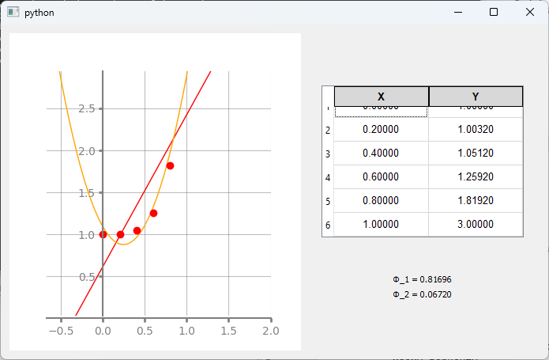

### Численное дифференцирование

Задача численного дифференцирования заключается в нахождении приближенного значения производной функции $y = f(x)$, заданной таблично.

В численном дифференцировании мы заменяем исходную функцию $y_i = f(x_i)$ на интерполяционный многочлен $\varphi(x, \overline{a}) = P_n(x)$, где $\overline{a}$ - набор коэффициентов, различный для каждого отрезка, и $R(x)$ - остаточный член приближения. Это позволяет нам приближенно находить производные функции, полагая 

$$
y'(x) \approx \varphi'(x, \overline{a})
$$

На практике часто используются аппроксимации первой и второй производных. Первая производная может быть аппроксимирована отрезками прямой:

$$
y' \approx \frac{y_{i + 1} - y_i}{x_{i + 1} - x_i} = const
$$

При использовании интерполяционного многочлена второй степени для аппроксимации имеем:

$$
y'(x) \approx \frac{y_{i + 1} - y_i}{x_{i + 1} - x_i} +
\frac{
    \frac{y_{i + 2} - y_{i + 1}}{x_{i + 2} - x_{i + 1}} -
    \frac{y_{i + 1} - y_i}{x_{i + 1} - x_i} 
}{
    x_{i + 2} - x_i
} \cdot (2 \cdot x - x_i - x_{i + 1})
$$

При равноотстоящих точках разбиения данная формула обеспечивает второй порядок точности. Для вычисления второй производной также необходимо использовать интерполяционный многочлен, как минимум второй степени. После дифференцирования многочлена получаем:

$$
y''(x) \approx 2 \cdot
\frac{
    \frac{y_{i + 2} - y_{i + 1}}{x_{i + 2} - x_{i + 1}} -
    \frac{y_{i + 1} - y_i}{x_{i + 1} - x_i} 
}{
    x_{i + 2} - x_i
}
$$

Таким образом, численное дифференцирование позволяет нам приближенно находить производные функции, основываясь на интерполяции исходных данных.

#### Входные данные
Ниже приведен пример входных данных для решения задачи численного дифференцирования функции, соответствующий моему варианту.

| $i$   | 0      | 1      | 2      | 3      | 4      |
|-------|--------|--------|--------|--------|--------|
| $x_i$ | -0.2   | 0.0    | 0.2    | 0.4    | 0.6    |
| $y_i$ | 1.7722 | 1.5708 | 1.3694 | 1.1593 | 0.9273 |

$$
X ^ {\star} = 0.2
$$

#### Реализация численного дифференцирования

Ниже предоставлена программная реализация численного дифференцирования для нахождения производных первого и второго порядка с использованием интерполяционных многочленов различных порядков.

```python
def find_interval(X: Vector, x: float) -> Iterator[int]:
    return [i for i in range(len(X) - 1) if X[i] <= x <= X[i + 1]]

def first_derivative(X: Vector, Y: Vector, x: float) -> float | tuple[float, float]:
    indexes = find_interval(X, x)

    if not indexes:
        return np.nan

    results = []
    for i in indexes:
        numerator = Y[i + 1] - Y[i]
        denominator = X[i + 1] - X[i]
        results.append(numerator / denominator)

    if len(results) == 1:
        return results[0]
    return (results[0], results[1])

def second_derivative(X: Vector, Y: Vector, x: float) -> float:
    indexes = find_interval(X, x)

    if not indexes:
        return np.nan

    i = indexes[0]

    if i + 2 >= len(X):
        return np.nan

    term1 = (Y[i + 1] - Y[i]) / (X[i + 1] - X[i])
    term2 = (Y[i + 2] - Y[i + 1]) / (X[i + 2] - X[i + 1]) - term1
    term3 = 2 * x - X[i] - X[i + 1]

    return term1 + term2 / (X[i + 2] - X[i]) * term3

def second_derivative_factor(X: Vector, Y: Vector, x: float) -> float:
    indexes = find_interval(X, x)

    if not indexes:
        return np.nan

    i = indexes[0]

    if i + 2 >= len(X):
        return np.nan

    term1 = (Y[i + 2] - Y[i + 1]) / (X[i + 2] - X[i + 1])
    term2 = (Y[i + 1] - Y[i]) / (X[i + 1] - X[i])

    return 2.0 * (term1 - term2) / (X[i + 2] - X[i])
```

#### Результат

Ниже предоставлен пример работы программы с входными данными, соответствующими моему варианту

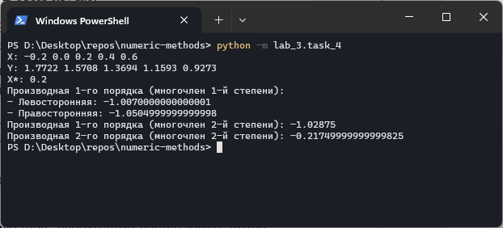

### Численное интегрирование

Численные методы интегрирования находят применение, когда аналитически вычислить определенный интеграл 

$$
F = \int_{a}^{b} f(x) \cdot dx
$$

не представляется возможным. Один из наиболее распространенных методов - замена подынтегральной функции на интерполяционный многочлен.

Используя интерполяционные многочлены разной степени, можно получить формулы интегрирования разной точности. Например, заменяя функцию на многочлен Лагранжа нулевой степени, проходящий через середину отрезка, мы получаем формулу прямоугольников:

$$
F = \int_{a}^{b} f(x) \cdot dx \approx \sum_{i = 1}^{N} h_i \cdot f(\frac{x_{i - 1} + x_}{2})
$$

Для таблично заданных функций удобно использовать интерполяционный многочлен первой степени, выбирая начало и конец отрезка. Это приводит к формуле трапеций:

$$
F = \int_{a}^{b} f(x) \cdot dx \approx \frac{1}{2} \cdot \sum_{i = 1}^{N} (f_i + f_{i - 1}) \cdot h_i
$$

Для увеличения точности можно заменить кривую параболой, используя интерполяционный многочлен второй степени. Получим формулу Симпсона:

$$
F = \int_{a}^{b} f(x) \cdot dx \approx \frac{1}{3} \cdot
\sum_{i = 1}^{N} (f_{i - 1} + 4 \cdot f_{i - \frac{1}{2}} + f_i) \cdot h_i
$$

Метод Рунге-Ромберга-Ричардсона позволяет улучшить точность вычислений. При наличии результатов вычислений на сетках с разными шагами $h$ и $k \cdot h$ можно использовать следующую формулу:

$$
F = \int_{a}^{b} f(x) \cdot dx = F_h + \frac{F_h - F_{kh}}{k^{p} - 1} + O(h ^ {p + 1})
$$

Этот метод позволяет получить более точные результаты, основываясь на интерполяции и вычислении разницы между результатами на разных сетках.

#### Входные данные

Ниже приведен пример входных данных для решения задачи численного интегрирования функции $f$ на отрезке $[a; b]$, соответствующий моему варианту.

$$
\begin{matrix}
    y = \frac{1}{3 \cdot x ^ 2 + 4x + 2} \\
    X_0 = -2, \ X_k = 2, \ h_1 = 1.0, \ h_2 = 0.5 \\
\end{matrix}
$$ 

#### Реализация методов численного интегрирования

Ниже предоставлена программная реализация методов численного интегрирования, такие как мтеод трапеций, прямоугольников, метод Симпсона. Методы представлены в виде функций, которые принимают на вход интегрируемую функцию и множество точек.

```python
def rectangle_method(f: Function, X: Vector) -> float:
    n = len(X)
    h = np.array([X[i] - X[i - 1] for i in range(1, n)])
    value = 0.0

    for i in range(n - 1):
        x = (X[i] + X[i + 1]) * 0.5
        value += h[i] * f(x)

    return value

def trapezoid_method(Y: Vector, X: Vector) -> float:
    n = len(X)
    h = np.array([X[i] - X[i - 1] for i in range(1, n)])
    value = 0.0

    for i in range(n - 1):
        value += (Y[i] + Y[i + 1]) * h[i]

    return value * 0.5

def simpson_method(f: Function, X: Vector) -> float:
    n = len(X)
    h = np.array([X[i] - X[i - 1] for i in range(1, n)])
    value = 0.0
    Y = np.zeros(2 * n - 1)

    for i in range(n):
        Y[2 * i] = f(X[i])
        if i + 1 < n:
            Y[2 * i + 1] = f((X[i] + X[i + 1]) * 0.5)

    for i in range(n - 1):
        value += (Y[2 * i] + 4 * Y[2 * i + 1] + Y[2 * i + 2]) * h[i] * 0.5

    return value / 3.0

def runge_rombert_method(integral_1: float, h1: float, integral_2: float, h2: float, p: int) -> tuple[float, float]:
    return (
        integral_1 + (integral_1 - integral_2) / ((h2 / h1) ** p - 1.0,
        abs((integral_1 - integral_2) / (2**p - 1.0)),
    )
```

#### Результат

Ниже предоставлен пример работы программы с входными данными, соответствующими моему варианту


## Лабораторная работа №2

### Описание программы

Для решения текущей лабораторной работы была написана программа на языке Python с применением таких библиотек как scipy, numpy, PyQt и matplotlib.

### Запуск программ

Для запуска программ необходимо установить все вышеперечисленные библиотеки и ввести команду `python -m lab_4.task_{n}`, где `n` - номер задания лабораторной работы.

### Численные методы решения задачи Коши

Задача Коши представляет из себя следующую систему

$$
\left\lbrace
    \begin{matrix}
        y' = f(x, y) \\
        y(x_0) = y_0 \\
    \end{matrix}
\right.
$$

где $y' = f(x, y)$ - дифференциальное уравнение, а $y(x_0) = y_0$ - начальное условие задачи Коши.

Для решения данной задачи с использованием численных методов часто вводят разностную сетку на отрезке $[a, b]$:

$$
\Omega ^ {(k)} =\left\lbrace x_k = x_0 + h \cdot k \right\}
$$

Здесь, точки $x_i$ - узлы сетки, $h$ - шаг разностной сетки.

Чтобы численно найти приближенное решение задачи Коши, мы будем использовать сеточную функцию, которая представляет совокупность значений функции на узлах сетки.

Явный метод Эйлера - один из методов численного решения обыкновенных дифференциальных уравнений. Его применение в практике ограничено из-за невысокой точности. Этот метод можно вывести разными способами: геометрически, используя разложение в ряд Тейлора, разностную аппроксимацию производной или квадратурный метод.

Для геометрического вывода метода Эйлера начнем с известного решения в точке $x_0$ из начального условия. Рассмотрим процесс нахождения решения в точке $x_1$. График функции $y ^ {(h)}$, являющейся решением задачи Коши, представляет собой гладкую кривую, проходящую через точку $(x_0, y_0)$ с касательной в этой точке. Угловой коэффициент касательной равен значению производной в $(x_0, y_0)$, которое равно значению правой части дифференциального уравнения в этой точке.

При небольшом шаге $h$ график функции и касательная почти не различаются, так что мы можем использовать значение касательной $y_1$ вместо точного значения $y_{1, real}$.

Погрешность $\left| y_1 - y_{1, real} \right|$ представляет собой отрезок $CD$ графически. Из прямоугольного треугольника $ABC$ мы получаем $\Delta y = h \cdot y'(x_0)$. Подставляя $\Delta y = y_1 - y_0$ и производную $y'(x_0)$ из уравнения, мы получаем

$$
y_1 = y_0 + h \cdot f(x_0, y_0)
$$

Повторяя этот процесс для $(x_1, y_1)$ как начальной точки, мы получаем значение $y_2$ в точке $x_2$ и т.д.

Неявный метод Эйлера, или метод трапеций - это численный метод решения задачи Коши для обыкновенного дифференциального уравнения первого порядка. Этот метод является классическим и отличается высокой точностью и устойчивостью при больших значениях шага интегрирования.
Основная идея метода заключается в замене производной функции на приближенное значение, используя формулу для среднего значения. В результате получается неявное уравнение, которое численно решается. Это позволяет учесть влияние будущих значений функции при вычислении текущего шага, что обеспечивает более точные результаты, особенно при интегрировании на больших интервалах.

Семейство явных методов Рунге-Кутты $p$-го порядка записывается в общем виде через следующие формулы

$$
\begin{matrix}
    y_{k + 1} = y_k + \Delta y_k \\
    \Delta y_k = \sum_{i = 1}^{p} c_i \cdot K_i^k \\
    K_i^{k} = h \cdot f(x_k + a_i h, y_k + h \cdot \sum_{j = 1}^{i - 1} b_{ij} K_j^{k})
\end{matrix}
$$

где $i = \overline{2, p}$. В частности, метод Рунге-Кутты четвертого порядка имеет вид:

$$
\begin{matrix}
    \Delta y_k = \frac{1}{6} \cdot (K_1^{k} + K_2^{k} + K_3^{k} + K_4^{k}) \\
    K_1^{k} = h \cdot f(x_k, y_k); \ K_2^{k} = h \cdot f(x_k + 0.5 \cdot h, y_k + 0.5 \cdot K_1^{k}) \\
    K_3^{k} = h \cdot f(x_k + 0.5 \cdot h, y_k + 0.5 \cdot K_2^{k}); \
    K_4^{k} = h \cdot f(x_k + h, y_k + K_3^{k})
\end{matrix}
$$

метод Адамса четвертого порядка точности основывается на использовании интерполяционного многочлена третьей степени, построенного по значениям подынтегральной функции в последних четырех узлах. Полученная формула для $y_{k+1}$ выражается следующим образом:

$$
y_{k + 1} = y_k + \frac{h}{24} \cdot (55 \cdot f_k - 59 \cdot f_{k - 1} + 37 \cdot f_{k - 2} - 9 \cdot f_{k - 3} )
$$

Метод Адамса, как и другие многошаговые методы, требует предварительного вычисления решений в первых четырех узлах. Решение в узле $x_0$ известно из начальных условий, а решения в узлах $x_1, x_2, x_3$ могут быть получены с использованием одношагового метода, например, метода Рунге-Кутты четвертого порядка.

Для системы обыкновенных дифференциальных уравнений первого порядка задача Коши имеет вид:

$$
\left\lbrace
    \begin{matrix}
        y'_1 = f_1(x, y, y_1, y_2, \ldots, y_n) \\
        y'_2 = f_2(x, y, y_1, y_2, \ldots, y_n) \\
        \ldots \\
        y'_n = f_n(x, y, y_1, y_2, \ldots, y_n) \\
    \end{matrix}
\right.
$$

с начальными условиями $y_1(x_0) = y_{01}, \ y_2(x_0) = y_{02}, \ldots, y_n(x_0) = y_{0n}$. Для этой системы уравнений можно применить все вышеупомянутые методы, решая уравнения по порядку.

Для задачи Коши второго порядка $y'' = f(x, y, y')$ можно преобразовать ее в систему уравнений, используя замену $z = y'$:

$$
\left\lbrace
    \begin{matrix}
        z' = f(x, y, z) \\
        y' = z(x)
    \end{matrix}
\right.
$$

с начальными условиями $y(x_0$ = y_0, y'(x_0) = z(x_0) = z_0$.

#### Входные данные

Ниже приведен пример входных данных для решения задачи численного решения задачи Коши, соответствующий моему варианту.

$$
\left\lbrace
    \begin{matrix}
        y'' - 4xy' + (4x^{2} - 2) \cdot y = 0 \\
        y(0) = 1
    \end{matrix}
\right.
$$

где $x \in [0; 1]$ и размер шага $h = 0.1$. Аналитическое решение такой задачи Коши представляет из себя функцию вида

$$
y = (1 + x) \cdot e ^ {x ^ {2}}
$$

#### Реализация методов численного решения задачи Коши

Ниже представлена программная реализация численных методов решения задачи Коши. Методы реализованы в виде функций, принимающих на вход данные системы и спроектированы таким образом, чтобы могли быть переиспользованы как для решения уравнений первого порядка, так и для второго.

```python
def euler(eq: DiffEquation, y_0: Vector, grid: Grid) -> Matrix:
    F = convert_to_system_function(eq)
    X = grid.range
    Y = y_0

    answer = np.zeros((1 + len(y_0), len(X)))
    answer[:, 0] = (X[0], *y_0.flat)

    for i in range(1, len(X)):
        Y = Y + grid.h * F(X[i - 1], Y)
        answer[:, i] = (X[i], *Y.flat)

    return answer

def euler_with_continuations(eq: DiffEquation, y_0: Vector, grid: Grid) -> Matrix:
    P = euler(eq, y_0, grid)

    F = convert_to_system_function(eq)
    X = grid.range
    Y = y_0

    answer = np.zeros((1 + len(y_0), len(X)))
    answer[:, 0] = (X[0], *y_0.flat)

    for i in range(1, len(X)):
        Y_P = np.array(list(P[1:, i].flat))
        Y = Y + grid.h * (F(X[i - 1], Y) + F(X[i], Y_P)) * 0.5
        answer[:, i] = (X[i], *Y.flat)

    return answer

def runge_kutta(eq: DiffEquation, y_0: Vector, grid: Grid) -> Matrix:
    h = grid.h
    F = convert_to_system_function(eq)
    X = grid.range
    Y = y_0

    answer = np.zeros((1 + len(y_0), len(X)))
    answer[:, 0] = (X[0], *y_0.flat)

    for i in range(1, len(X)):
        K_1 = h * F(X[i - 1], Y)
        K_2 = h * F(X[i - 1] + h * 0.5, Y + K_1 * 0.5)
        K_3 = h * F(X[i - 1] + h * 0.5, Y + K_2 * 0.5)
        K_4 = h * F(X[i - 1] + h, Y + K_3)
        Y = Y + (K_1 + 2.0 * K_2 + 2.0 * K_3 + K_4) / 6.0
        answer[:, i] = (X[i], *Y.flat)

    return answer

def adams(eq: DiffEquation, y_0: Vector, grid: Grid, underlying_method: OdeSolveMethod = runge_kutta) -> Matrix:
    F = convert_to_system_function(eq)
    X = grid.range
    h = grid.h

    answer = np.zeros((1 + len(y_0), len(X)))
    answer[:, :4] = underlying_method(eq, y_0, Grid(X[0], X[3], h))

    for i in range(4, len(X)):
        f = [F(answer[0, j], answer[1:, j]) for j in range(i - 4, i)]
        Y = answer[1:, i - 1] + h / 24 * (55 * f[3] - 59 * f[2] + 37 * f[1] - 9 * f[0])
        answer[:, i] = (X[i], *Y.flat)

    return answer
```

#### Результат

Ниже предоставлен пример работы программы с входными данными, соответствующими моему варианту

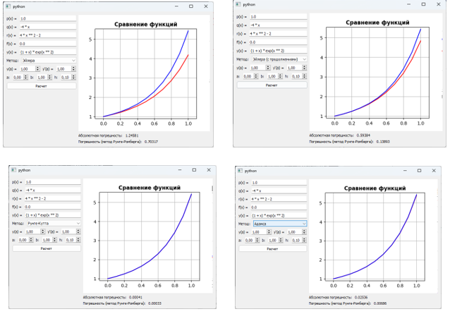

### Численные методы решения краевой задачи для ОДУ

Краевая задача включает в себя два типа граничных условий. Граничные условия первого рода задают значения функции на концах отрезка, например

$$
\begin{matrix}
    y(a) = y_0 \\
    y(b) = y_1 \\
\end{matrix}
$$

Граничные условия второго рода определяют значения производных функции на концах отрезка, например

$$
\begin{matrix}
    y'(a) = \hat{y}_0 \\
    y'(b) = \hat{y}_1 \\
\end{matrix}
$$

или линейную комбинацию значений и производных, такую как

$$
\begin{matrix}
    \alpha \cdot y(a) + \beta \cdot y'(a) = \hat{y}_0 \\
    \delta \cdot y(b) + \gamma \cdot y'(b) = \hat{y}_1 \\
\end{matrix}
$$

Возможно использование различных типов условий на разных концах отрезка.

Метод стрельбы - один из численных методов решения краевой задачи, который сводит задачу краевых условий к последовательному решению задачи Коши. Для начала, когда требуется решить краевую задачу с граничными условиями первого рода на отрезке $[a, b]$, мы формулируем задачу Коши с уравнением

$$
y'' = f(x, y, y')
$$

и начальными условиями $y(a) = y_0$ и $y'(b) = \eta$

Далее мы устанавливаем начальное значение параметра $\eta = \eta_0$ и решаем задачу Коши с помощью какого-либо метода. Если $y = y_0(x, y_0, \eta_0)$ является решением этой задачи на интервале $[a, b]$, мы сравниваем значение функции $y_0(b, y_0, \eta_0)$ с требуемым значением $y_1$ в правом конце отрезка. 

Затем мы сталкиваемся с задачей коррекции угла наклона касательной к решению в левом конце отрезка. Наша задача сформулирована как нахождение такого значения переменной $\eta ^ {\star}$, при котором решение $y(b, y_0, \eta ^ {\star})$ в правом конце отрезка совпадает со значением $y_1$. Иными словами, мы стремимся найти корень уравнения $\Phi(\eta) = y(b, y_0, \eta) - y_1 = 0$.

Следующее значение искомого корня определяется рекурсивно по формуле: 

$$
\eta_{j + 1} = \eta_{j + 1} -
\frac{\eta_{j + 1} - \eta_j}{\Phi(\eta_{j + 1}) - \Phi(\eta_j)} \cdot
\Phi(\eta_{j + 1})
$$

Такой подход позволяет приблизиться к искомому значению параметра $\eta$ с каждой итерацией, пока не будет достигнута необходимая точность.

Для дальнейшего описания метода конечных разностей рассмотрим задачу о двухточечной краевой задаче для линейного дифференциального уравнения второго порядка на отрезке $[a, b]$:

$$
\begin{matrix}
    y'' + p(x) \cdot y' + q(x) \cdot y = f(x) \\
    y(a) = y_0, \ y(b) y_1 \\
\end{matrix}
$$

Для численного решения данной краевой задачи применим метод конечных разностей. Вводятся следующие аппроксимации для производных:

$$
\begin{matrix}
    y_k' = \frac{y_{k + 1} - y_{k - 1}}{2h} + O(h ^ 2) \\
    y_k'' = \frac{y_{k + 1} - 2 \cdot y_k + y_{k - 1}}{h ^ 2} + O(h ^ 2)
\end{matrix}
$$

Здесь $h$ представляет собой шаг дискретизации. Подставляя эти аппроксимации в дифференциальное уравнение, получаем систему уравнений для нахождения значений $y_k$:

$$
\left\lbrace
    \begin{matrix}
        y_0 = y_a \\
        \frac{y_{k + 1} - 2 y_k + y_{k - 1}}{h ^ 2} + p(x_k) \cdot
        \frac{y_{k + 1} - y_{k - 1}}{2h} +
        q(x_k) \cdot y_k = f(x_k) \\
        y_N = y_b
    \end{matrix}
\right.
$$

для $k = 1, 2, \ldots, N - 1$, где $x_k = a + k \cdot h$.

#### Входные данные

Ниже приведен пример входных данных для решения задачи численного решения краевой задачи, соответствующий моему варианту.

$$
\left\lbrace
    \begin{matrix}
        (2x + 1) \cdot y'' + 4xy' - 4y = 0 \\
        y'(0) = -1 \\
        y'(1) + 2y(1) = 3 \\
    \end{matrix}
\right.
$$

Аналитическое решение такой задачи имеет вид $y(x) = x + e ^ {-2x}$

#### Реализация численных методов решения краевой задачи

Ниже приведена программная реализация метода стрельбы и метода конечных разностей. Методы реализованы в виде функций и спроектированы таким образом, чтобы вспомогательные методы, которые используют данные алгоритмы, передавались в качестве аргументов

```python
def shooting_method(
    eq: DiffEquation,
    cond_1: BoundaryCondition,
    cond_2: BoundaryCondition,
    grid: Grid,
    underlying_method: OdeSolveMethod = runge_kutta,
    found_root=newton_method,
) -> Matrix:
    def build_ode_condition(nu: float) -> Vector:
        match cond_1:
            case (0.0, b, c):
                return np.array([-c / b, nu])
            case (a, 0.0, c):
                return np.array([nu, -c / a])
            case (a, b, c):
                return np.array(
                    [
                        -c / b - a / b * nu,
                        nu,
                    ]
                )

    def count_difference(y: float, dy: float):
        a, b, c = cond_2
        return a * dy + b * y + c

    def g(nu: float) -> float:
        Y_0 = build_ode_condition(nu)
        answer = underlying_method(eq, Y_0, grid)
        return count_difference(answer[1][-1], answer[2][-1])

    nu = found_root(g, 0.0, 4.0, 0.001, 10).x
    Y_0 = build_ode_condition(nu)
    return underlying_method(eq, Y_0, grid)

def finite_diff_method(eq: DiffEquation, cond_1: BoundaryCondition, cond_2: BoundaryCondition, grid: Grid) -> Matrix:
    X = grid.range
    N = len(X)
    answer = np.zeros_like(X)

    p = lambda x: eq.q(x) / eq.p(x)
    q = lambda x: eq.r(x) / eq.p(x)
    f = lambda x: - eq.f(x) / eq.p(x)
    h = grid.h

    g_1 = lambda x: 1 - 0.5 * p(x) * h
    g_2 = lambda x: q(x) * h ** 2 - 2
    g_3 = lambda x: 1 + 0.5 * p(x) * h
    g_4 = lambda x: f(x) * h ** 2
    
    c1, c2, c3 = cond_1
    if c1 == 0.0:
        y_0 = - c3 / c2
        first = [0.0, g_2(X[1]), g_3(X[1])], g_4(X[1]) - g_1(X[1]) * y_0
        i = 2
        answer[0] = y_0

    elif c2 == 0.0:
        first = [0.0, -c1, c1], - c3 * h
        i = 1

    else:
        first = [0.0, -c1, c1 + c2 * h], - c3 * h
        i = 1

    c1, c2, c3 = cond_2
    if c1 == 0.0:
        y_n = - c3 / c2
        last = [g_1(X[-2]), g_2(X[-2]), 0.0], g_4(X[-2]) - g_3(X[-2]) * y_n
        j = N - 2
        answer[N - 1] = y_n

    elif c2 == 0.0:
        last = [-c1, c1, 0.0], - c3 * h
        j = N - 1

    else:
        last = [-c1, c1 + c2 * h, 0.0], - c3 * h
        j = N - 1

    A = np.zeros((j - i + 2, 3)) # матрица коэффициентов (n x 3)
    B = np.zeros((j - i + 2, 1)) # матрица совбодных коэффициентов (n x 1)
    A[0, :], B[0, 0] = first
    A[-1, :], B[-1, 0] = last

    for t in range(i, j):
        t2 = t - i + 1
        x = X[t - 1]
        A[t2, :] = [g_1(x), g_2(x), g_3(x)]
        B[t2, 0] = g_4(x)

    # решаем систему методом прогонки
    answer[i - 1:j + 1] = solve_system(A, B)
    return np.array([X, answer.flat])
```

#### Результат

Ниже предоставлен пример работы программы с входными данными, соответствующими моему варианту

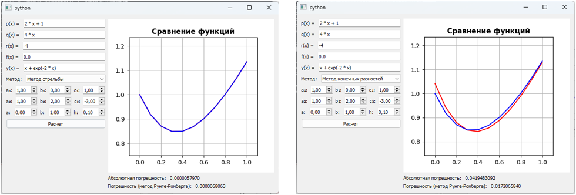
